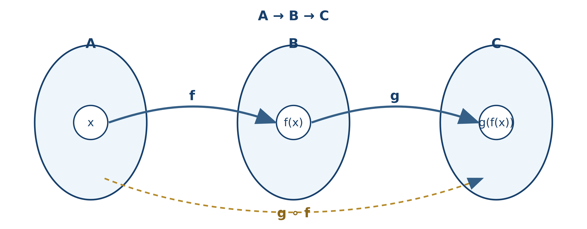

# Lógica y conjuntos

*Lenguaje, operaciones, relaciones, funciones y cardinalidad*

## Introducción {.unnumbered .unlisted}

La lógica y la teoría de conjuntos proporcionan el lenguaje con el que se expresan buena parte de las matemáticas. Cuando se afirma que una función es inyectiva, que un número pertenece a cierto conjunto o que una propiedad se cumple para todo elemento de un dominio, se están utilizando ideas que estudiaremos en este capítulo.

Lógica y conjuntos no son temas aislados. Existe una correspondencia profunda entre ellos: la conjunción de dos condiciones se relaciona con la intersección de sus conjuntos solución; la disyunción, con la unión; y la negación, con el complemento. Esta relación permitirá pasar de una afirmación verbal a una expresión simbólica y de ella a una representación gráfica o algebraica.

El capítulo sigue la primera unidad del programa de Álgebra Superior de la Facultad de Ciencias de la UASLP y amplía su componente lógico para construir una base sólida para los capítulos posteriores [@uaslp2011]. La organización y varios énfasis didácticos retoman la tradición expositiva de @silvaLazo2007, con notación actualizada, demostraciones propias y ejemplos nuevos.

### Objetivos del capítulo {.unnumbered .unlisted}

Al finalizar, el lector será capaz de:

- emplear con precisión el lenguaje y la notación de conjuntos;
- reconocer proposiciones, conectivos y proposiciones abiertas;
- construir e interpretar tablas de verdad;
- expresar afirmaciones mediante cuantificadores y negar correctamente esas afirmaciones;
- operar con conjuntos y demostrar sus propiedades;
- resolver problemas de conteo mediante cardinalidad e inclusión-exclusión;
- definir relaciones y reconocer algunas de sus propiedades;
- distinguir dominio, codominio e imagen de una función;
- clasificar funciones como inyectivas, suprayectivas o biyectivas;
- comparar conjuntos finitos e infinitos mediante correspondencias biyectivas;
- simplificar expresiones booleanas y relacionarlas con circuitos lógicos.

::: {.callout-tip title="Pregunta inicial"}
Un sistema electrónico enciende una alarma cuando la fuente está habilitada y ocurre al menos una de estas dos condiciones: la temperatura es alta o la corriente rebasa el límite de seguridad. ¿Cómo se representa la regla?, ¿cómo se comprueba que dos expresiones distintas describen el mismo comportamiento? y ¿cómo se transforma la expresión en un circuito lógico? Al final del capítulo podremos responder las tres preguntas.
:::

## Lenguaje de conjuntos {#sec-lenguaje-conjuntos}

### Conjunto y elemento {.unnumbered .unlisted}

Las palabras **conjunto** y **elemento** se consideran nociones primitivas: se comprenden mediante su uso y no se definen a partir de conceptos más simples. De manera intuitiva, un conjunto agrupa objetos que pueden distinguirse con claridad. Esos objetos son sus elementos.

Los conjuntos se denotan normalmente con letras mayúsculas y sus elementos con letras minúsculas. Si $x$ es un elemento de $A$, escribimos $x\in A$. Si no pertenece, escribimos $x\notin A$.

::: {.callout-note title="Importante: pertenencia no es inclusión"}
La expresión $x\in A$ relaciona un **elemento** con un conjunto. La expresión $B\subseteq A$ relaciona **dos conjuntos**. Por ejemplo, si $A=\{1,2,3\}$, entonces $1\in A$ y $\{1\}\subseteq A$, pero $\{1\}\in A$ es falsa.
:::

### Formas de representar un conjunto {.unnumbered .unlisted}

Un conjunto se representa **por extensión** cuando se enumeran sus elementos:

$$
A=\{2,4,6,8\}.
$$

Se representa **por comprensión** cuando se especifica la propiedad que caracteriza a sus elementos:

$$
A=\{x\in\mathbb N:x\text{ es par y }2\le x\le 8\}.
$$

El orden y la repetición no modifican un conjunto:

$$
\{1,2,3\}=\{3,2,1\}=\{1,1,2,3\}.
$$

### Conjunto universal, vacío y unitario {.unnumbered .unlisted}

El **conjunto universal** $U$ contiene todos los objetos considerados en una situación. Su elección depende del problema. El **conjunto vacío** no contiene elementos y se denota por $\varnothing$. Un **conjunto unitario** contiene exactamente un elemento.

::: {.callout-warning title="Error frecuente"}
$\varnothing$ y $\{\varnothing\}$ no son iguales. El primero no tiene elementos; el segundo tiene un elemento, que es precisamente el conjunto vacío. Por tanto,
$$
|\varnothing|=0,\qquad |\{\varnothing\}|=1.
$$
:::

### Subconjuntos, igualdad y conjunto potencia {.unnumbered .unlisted}

::: {.callout-note title="Definición: subconjunto"}
Sean $A$ y $B$ conjuntos. Se dice que $A$ es subconjunto de $B$, y se escribe $A\subseteq B$, cuando todo elemento de $A$ también pertenece a $B$:
$$
A\subseteq B \quad\Longleftrightarrow\quad \forall x\,(x\in A\Rightarrow x\in B).
$$
:::

Si $A\subseteq B$ y $A\ne B$, entonces $A$ es un **subconjunto propio** de $B$, escrito $A\subsetneq B$.

Dos conjuntos son iguales si contienen exactamente los mismos elementos:

$$
A=B\quad\Longleftrightarrow\quad A\subseteq B\text{ y }B\subseteq A.
$$

Esta equivalencia origina el método de **doble inclusión**, que utilizaremos para demostrar igualdades de conjuntos.

El **conjunto potencia** de $A$, denotado por $\mathcal P(A)$, es el conjunto de todos los subconjuntos de $A$. Si $A=\{a,b\}$, entonces

$$
\mathcal P(A)=\{\varnothing,\{a\},\{b\},\{a,b\}\}.
$$

Si $A$ tiene $n$ elementos, entonces $\mathcal P(A)$ tiene $2^n$ elementos. Esto ocurre porque, al formar un subconjunto, cada elemento presenta dos posibilidades independientes: incluirse o no incluirse.

### Ejemplo resuelto {.unnumbered .unlisted}

Sea $B=\{1,\{2\},3\}$. Determinemos el valor de verdad de cuatro afirmaciones:

1. $2\in B$ es falsa, porque el elemento de $B$ es $\{2\}$, no $2$.
2. $\{2\}\in B$ es verdadera.
3. $\{2\}\subseteq B$ es falsa, porque exigiría $2\in B$.
4. $\{\{2\}\}\subseteq B$ es verdadera, porque $\{2\}\in B$.

## Proposiciones y conectivos lógicos {#sec-proposiciones}

### Proposiciones y valores de verdad {.unnumbered .unlisted}

::: {.callout-note title="Definición: proposición"}
Una **proposición** es un enunciado declarativo al que puede asignarse exactamente uno de dos valores de verdad: verdadero ($V$) o falso ($F$).
:::

“$7$ es primo” es una proposición verdadera. “$9<4$” es una proposición falsa. Una pregunta o una orden no es una proposición. Tampoco lo es $x+2=5$ mientras no se especifique el valor de $x$ o se cuantifique la variable.

Una expresión como $p(x):x+2=5$ se denomina **proposición abierta** o **predicado**. Al fijar un dominio, los valores que la hacen verdadera forman su **conjunto solución**. Si el dominio es $\mathbb Z$, entonces el conjunto solución es $\{3\}$.

### Conectivos fundamentales {.unnumbered .unlisted}

Sean $p$ y $q$ proposiciones.

| Operación | Símbolo | Lectura | Condición de verdad |
|---|---:|---|---|
| Negación | $\neg p$ | no $p$ | verdadera cuando $p$ es falsa |
| Conjunción | $p\land q$ | $p$ y $q$ | verdadera solo si ambas son verdaderas |
| Disyunción | $p\lor q$ | $p$ o $q$ | falsa solo si ambas son falsas |
| Implicación | $p\Rightarrow q$ | si $p$, entonces $q$ | falsa solo si $p$ es verdadera y $q$ falsa |
| Bicondicional | $p\Leftrightarrow q$ | $p$ si y solo si $q$ | verdadera cuando tienen el mismo valor |

La disyunción matemática es normalmente **inclusiva**: $p\lor q$ permite que $p$, $q$ o ambas sean verdaderas.

| $p$ | $q$ | $\neg p$ | $p\land q$ | $p\lor q$ | $p\Rightarrow q$ | $p\Leftrightarrow q$ |
|:---:|:---:|:---:|:---:|:---:|:---:|:---:|
| V | V | F | V | V | V | V |
| V | F | F | F | V | F | F |
| F | V | V | F | V | V | F |
| F | F | V | F | F | V | V |

::: {.callout-tip title="Cómo entender la implicación"}
$p\Rightarrow q$ expresa que no puede ocurrir $p$ sin que ocurra $q$. Por ello solo es falsa en el caso $p=V$ y $q=F$. Además,
$$
p\Rightarrow q\equiv \neg p\lor q.
$$
:::

### Tautología, contradicción y contingencia {.unnumbered .unlisted}

Una proposición compuesta es una **tautología** si resulta verdadera para todas las combinaciones de valores de verdad. Es una **contradicción** si siempre es falsa y una **contingencia** si en algunas filas es verdadera y en otras falsa.

$$
p\lor\neg p
$$

es una tautología, mientras que $p\land\neg p$ es una contradicción.

### Ejemplo: distribución de la implicación {.unnumbered .unlisted}

Comprobemos que

$$
p\Rightarrow(q\land r)\equiv (p\Rightarrow q)\land(p\Rightarrow r).
$$

$$
\begin{aligned}
p\Rightarrow(q\land r)
&\equiv \neg p\lor(q\land r)\\
&\equiv (\neg p\lor q)\land(\neg p\lor r)\\
&\equiv (p\Rightarrow q)\land(p\Rightarrow r).
\end{aligned}
$$

Como la igualdad se obtuvo mediante equivalencias válidas, el bicondicional entre ambas expresiones es una tautología.

## Cuantificadores y equivalencias lógicas {#sec-cuantificadores}

### Dominio y cuantificadores {.unnumbered .unlisted}

El valor de verdad de un predicado depende de su dominio. Por ejemplo, $x^2=2$ no tiene solución en $\mathbb Q$, pero sí en $\mathbb R$.

El **cuantificador universal** afirma que una propiedad se cumple para todos los elementos del dominio:

$$
\forall x\in D,\;p(x).
$$

El **cuantificador existencial** afirma que se cumple para al menos uno:

$$
\exists x\in D\text{ tal que }p(x).
$$

::: {.callout-note title="Orden de los cuantificadores"}
El orden puede cambiar el significado. En $\mathbb R$,
$$
\forall x\,\exists y\;(x+y=0)
$$
es verdadera, pues cada $x$ tiene su propio $y=-x$. En cambio,
$$
\exists y\,\forall x\;(x+y=0)
$$
es falsa: un único $y$ no puede cancelar a todos los números reales.
:::

### Negación de proposiciones cuantificadas {.unnumbered .unlisted}

Negar “todos” produce “existe al menos uno que no”; negar “existe” produce “ninguno”:

$$
\neg(\forall x\in D\;p(x))\equiv\exists x\in D\;\neg p(x),
$$

$$
\neg(\exists x\in D\;p(x))\equiv\forall x\in D\;\neg p(x).
$$

La negación de “todo sensor está calibrado” no es “ningún sensor está calibrado”, sino “existe al menos un sensor que no está calibrado”.

### Recíproca, contraria y contrarrecíproca {.unnumbered .unlisted}

Para la implicación $p\Rightarrow q$:

| Nombre | Forma |
|---|---|
| Recíproca | $q\Rightarrow p$ |
| Contraria | $\neg p\Rightarrow\neg q$ |
| Contrarrecíproca | $\neg q\Rightarrow\neg p$ |

La implicación original es equivalente a su contrarrecíproca, pero no necesariamente a su recíproca ni a su contraria:

$$
p\Rightarrow q\equiv\neg q\Rightarrow\neg p.
$$

### Leyes fundamentales de equivalencia {.unnumbered .unlisted}

| Ley | Equivalencia lógica |
|---|---|
| Doble negación | $\neg(\neg p)\equiv p$ |
| Idempotencia | $p\lor p\equiv p$, $p\land p\equiv p$ |
| Conmutatividad | $p\lor q\equiv q\lor p$, $p\land q\equiv q\land p$ |
| Asociatividad | $(p\lor q)\lor r\equiv p\lor(q\lor r)$ y análoga para $\land$ |
| Distributividad | $p\land(q\lor r)\equiv(p\land q)\lor(p\land r)$ |
| De Morgan | $\neg(p\land q)\equiv\neg p\lor\neg q$ |
| De Morgan | $\neg(p\lor q)\equiv\neg p\land\neg q$ |
| Absorción | $p\lor(p\land q)\equiv p$, $p\land(p\lor q)\equiv p$ |
| Implicación | $p\Rightarrow q\equiv\neg p\lor q$ |
| Bicondicional | $p\Leftrightarrow q\equiv(p\Rightarrow q)\land(q\Rightarrow p)$ |

Estas leyes pueden demostrarse con tablas de verdad. También pueden utilizarse como reglas de transformación, siempre que cada paso se justifique.

## Operaciones y propiedades de los conjuntos {#sec-operaciones-conjuntos}

Sea $U$ un conjunto universal y sean $A,B\subseteq U$.

### Operaciones fundamentales {.unnumbered .unlisted}

::: {.callout-note title="Definiciones"}
$$
\begin{aligned}
A\cup B &= \{x\in U:x\in A\lor x\in B\},\\
A\cap B &= \{x\in U:x\in A\land x\in B\},\\
A^c &= \{x\in U:x\notin A\},\\
A\setminus B &= \{x\in U:x\in A\land x\notin B\}.
\end{aligned}
$$
:::

Dos conjuntos son **disjuntos** si $A\cap B=\varnothing$. La **diferencia simétrica** contiene los elementos que pertenecen exactamente a uno de los dos conjuntos:

$$
A\triangle B=(A\setminus B)\cup(B\setminus A).
$$

### Ejemplo {.unnumbered .unlisted}

Sean $U=\{1,2,3,4,5,6\}$, $A=\{1,2,4,6\}$ y $B=\{2,3,4\}$. Entonces

$$
\begin{aligned}
A\cup B&=\{1,2,3,4,6\},\\
A\cap B&=\{2,4\},\\
A^c&=\{3,5\},\\
A\setminus B&=\{1,6\},\\
A\triangle B&=\{1,3,6\}.
\end{aligned}
$$

{#fig-venn-operaciones width=96%}

La @fig-venn-operaciones permite reconocer visualmente qué elementos deben conservarse en cada operación. El diagrama ayuda a formular y revisar una respuesta, pero una identidad general debe justificarse mediante las definiciones o una demostración por pertenencia.

### Correspondencia entre lógica y conjuntos {.unnumbered .unlisted}

Si $p(x)$ y $q(x)$ son predicados sobre $U$, con conjuntos solución $A$ y $B$, entonces:

| Lógica | Conjuntos |
|---|---|
| $p(x)\land q(x)$ | $A\cap B$ |
| $p(x)\lor q(x)$ | $A\cup B$ |
| $\neg p(x)$ | $A^c$ |
| $p(x)\land\neg q(x)$ | $A\setminus B$ |
| $p(x)\Rightarrow q(x)$ para todo $x$ | $A\subseteq B$ |
| $p(x)\Leftrightarrow q(x)$ para todo $x$ | $A=B$ |

### Leyes del álgebra de conjuntos {.unnumbered .unlisted}

$$
\begin{aligned}
A\cup A&=A,& A\cap A&=A &&\text{(idempotencia)},\\
A\cup B&=B\cup A,& A\cap B&=B\cap A &&\text{(conmutatividad)},\\
A\cap(B\cup C)&=(A\cap B)\cup(A\cap C) &&&\text{(distributividad)},\\
A\cup(A\cap B)&=A &&&\text{(absorción)},\\
(A\cup B)^c&=A^c\cap B^c &&&\text{(De Morgan)},\\
(A\cap B)^c&=A^c\cup B^c &&&\text{(De Morgan)}.
\end{aligned}
$$

### Demostración por pertenencia {.unnumbered .unlisted}

Demostremos

$$
A\cap(B\cup C)=(A\cap B)\cup(A\cap C).
$$

Sea $x$ un elemento arbitrario. Entonces:

$$
\begin{aligned}
x\in A\cap(B\cup C)
&\Longleftrightarrow x\in A\land x\in(B\cup C)\\
&\Longleftrightarrow x\in A\land(x\in B\lor x\in C)\\
&\Longleftrightarrow (x\in A\land x\in B)\lor(x\in A\land x\in C)\\
&\Longleftrightarrow x\in(A\cap B)\cup(A\cap C).
\end{aligned}
$$

Como la equivalencia se cumple para todo $x$, ambos conjuntos son iguales.

::: {.callout-tip title="Estructura de una demostración de igualdad"}
Puede emplearse una cadena de equivalencias de pertenencia, como en el ejemplo, o demostrar por separado $A\subseteq B$ y $B\subseteq A$. Un diagrama de Venn ayuda a formular una conjetura, pero no sustituye una demostración general.
:::

## Cardinalidad de conjuntos finitos y problemas de conteo {#sec-cardinalidad-finita}

### Cardinalidad {.unnumbered .unlisted}

La **cardinalidad** de un conjunto finito $A$, denotada por $|A|$, es su número de elementos. Para dos conjuntos finitos:

$$
|A\cup B|=|A|+|B|-|A\cap B|.
$$

La intersección se resta porque sus elementos se contaron una vez en $|A|$ y otra en $|B|$. Para tres conjuntos:

$$
\begin{aligned}
|A\cup B\cup C|
={}&|A|+|B|+|C|\\
&-|A\cap B|-|A\cap C|-|B\cap C|\\
&+|A\cap B\cap C|.
\end{aligned}
$$

Este resultado es un caso del **principio de inclusión-exclusión**.

### Ejemplo resuelto con tres conjuntos {.unnumbered .unlisted}

En un laboratorio se revisan $400$ dispositivos. Sean $T$, $P$ y $H$ los que utilizan sensores de temperatura, presión y humedad, respectivamente. Se conoce que

$$
\begin{gathered}
|T|=170,\quad |P|=150,\quad |H|=140,\\
|T\cap P|=70,\quad |T\cap H|=60,\quad |P\cap H|=50,\\
|T\cap P\cap H|=20.
\end{gathered}
$$

El número de dispositivos que usan al menos uno es

$$
170+150+140-70-60-50+20=300.
$$

Por tanto, $400-300=100$ no usan ninguno. Los que utilizan temperatura y presión, pero no humedad, son

$$
|(T\cap P)\setminus H|=|T\cap P|-|T\cap P\cap H|=70-20=50.
$$

::: {.callout-warning title="Error frecuente"}
El dato $|T\cap P|=70$ incluye normalmente a quienes también pertenecen a $H$. “Exactamente $T$ y $P$” exige restar la intersección triple.
:::

## Producto cartesiano y relaciones {#sec-producto-relaciones}

### Pares ordenados y producto cartesiano {.unnumbered .unlisted}

Dos pares ordenados son iguales si coinciden componente a componente:

$$
(a,b)=(c,d)\quad\Longleftrightarrow\quad a=c\text{ y }b=d.
$$

El **producto cartesiano** de $A$ y $B$ es

$$
A\times B=\{(a,b):a\in A\text{ y }b\in B\}.
$$

Si $A=\{1,2\}$ y $B=\{x,y,z\}$, entonces $|A\times B|=2\cdot3=6$. En general, para conjuntos finitos,

$$
|A\times B|=|A|\,|B|.
$$

En general $A\times B\ne B\times A$, pues el orden de las componentes importa.

### Distribución respecto de la unión {.unnumbered .unlisted}

La igualdad correcta es

$$
A\times(B\cup C)=(A\times B)\cup(A\times C).
$$

En efecto,

$$
\begin{aligned}
(a,b)\in A\times(B\cup C)
&\Longleftrightarrow a\in A\land(b\in B\lor b\in C)\\
&\Longleftrightarrow (a\in A\land b\in B)\lor(a\in A\land b\in C)\\
&\Longleftrightarrow (a,b)\in(A\times B)\cup(A\times C).
\end{aligned}
$$

### Relaciones {.unnumbered .unlisted}

::: {.callout-note title="Definición: relación binaria"}
Una relación $R$ de $A$ en $B$ es cualquier subconjunto de $A\times B$. Si $(a,b)\in R$, también se escribe $aRb$.
:::

El **dominio** de $R$ es el conjunto de primeras componentes que aparecen y su **recorrido** es el conjunto de segundas componentes relacionadas:

$$
\operatorname{Dom}(R)=\{a\in A:\exists b\in B,\,(a,b)\in R\},
$$

$$
\operatorname{Rec}(R)=\{b\in B:\exists a\in A,\,(a,b)\in R\}.
$$

La relación inversa es

$$
R^{-1}=\{(b,a):(a,b)\in R\}.
$$

### Propiedades de relaciones sobre un conjunto {.unnumbered .unlisted}

Cuando $R\subseteq A\times A$, puede ser:

- **reflexiva**, si $aRa$ para todo $a\in A$;
- **simétrica**, si $aRb\Rightarrow bRa$;
- **antisimétrica**, si $aRb\land bRa\Rightarrow a=b$;
- **transitiva**, si $aRb\land bRc\Rightarrow aRc$.

Una relación reflexiva, simétrica y transitiva es una **relación de equivalencia**. Una relación reflexiva, antisimétrica y transitiva es una **relación de orden parcial**.

### Ejemplo {.unnumbered .unlisted}

En $\mathbb Z$, definamos $aRb$ si $a-b$ es múltiplo de $3$. La relación es reflexiva porque $a-a=0$, simétrica porque si $3\mid(a-b)$, entonces $3\mid(b-a)$, y transitiva porque la suma de dos múltiplos de $3$ vuelve a ser múltiplo de $3$. Por tanto, es una relación de equivalencia.

## Funciones: definición, representación y operaciones {#sec-funciones}

### Definición formal {.unnumbered .unlisted}

::: {.callout-note title="Definición: función"}
Una función $f:A\to B$ es una relación que asigna a **cada** elemento $x\in A$ **exactamente un** elemento $y\in B$. Escribimos $y=f(x)$.
:::

En $f:A\to B$:

- $A$ es el **dominio**;
- $B$ es el **codominio**;
- $f(A)=\{f(x):x\in A\}$ es la **imagen** o recorrido.

Siempre se cumple $f(A)\subseteq B$, pero la imagen no tiene que ser todo el codominio.

::: {.callout-warning title="Dos condiciones que no deben olvidarse"}
Para ser función, ningún elemento del dominio puede quedar sin imagen y ningún elemento del dominio puede tener dos imágenes distintas. En cambio, varios elementos del dominio sí pueden compartir una misma imagen.
:::

{#fig-relacion-funcion width=98%}

En la @fig-relacion-funcion, el diagrama central sí representa una función aunque dos entradas compartan la imagen $a$. Esa repetición afecta la inyectividad, no la definición de función.

### Representaciones e igualdad {.unnumbered .unlisted}

Una función puede representarse mediante una regla algebraica, una tabla, pares ordenados, un diagrama sagital o una gráfica. Dos funciones son iguales cuando tienen el mismo dominio, el mismo codominio y asignan el mismo valor a cada elemento del dominio.

Por ello, $f(x)=x^2$ definida de $\mathbb R$ en $\mathbb R$ y $g(x)=x^2$ definida de $[0,\infty)$ en $[0,\infty)$ no son la misma función, aunque compartan fórmula.

### Composición e identidad {.unnumbered .unlisted}

Sean $f:A\to B$ y $g:B\to C$. La composición $g\circ f:A\to C$ se define por

$$
(g\circ f)(x)=g(f(x)).
$$

La función identidad en $A$ es $\operatorname{id}_A:A\to A$, dada por $\operatorname{id}_A(x)=x$. Satisface

$$
f\circ\operatorname{id}_A=f,
\qquad
\operatorname{id}_B\circ f=f.
$$

La composición es asociativa cuando las composiciones están definidas, pero en general no es conmutativa.

{#fig-composicion-funciones width=90%}

La @fig-composicion-funciones ayuda a recordar el orden: aunque $g\circ f$ se escribe con $g$ a la izquierda, al evaluar se aplica primero $f$.

### Ejemplo {.unnumbered .unlisted}

Sean $f(x)=2x+1$ y $g(x)=x^2$, ambas de $\mathbb R$ en $\mathbb R$. Entonces

$$
(g\circ f)(x)=(2x+1)^2,
\qquad
(f\circ g)(x)=2x^2+1.
$$

Como estas expresiones no son iguales para todo $x$, $g\circ f\ne f\circ g$.

### Imagen inversa y relación inversa {.unnumbered .unlisted}

Para $C\subseteq B$, la **preimagen** de $C$ es

$$
f^{-1}(C)=\{x\in A:f(x)\in C\}.
$$

Esta notación se utiliza aun cuando $f$ no tenga función inversa. Debe distinguirse entre la preimagen de un conjunto, la relación inversa y la función inversa.

## Funciones inyectivas, suprayectivas y biyectivas {#sec-tipos-funciones}

### Tres formas de comportamiento {.unnumbered .unlisted}

Sea $f:A\to B$.

::: {.callout-note title="Definiciones"}
- $f$ es **inyectiva** si $f(x_1)=f(x_2)\Rightarrow x_1=x_2$. Elementos distintos del dominio no comparten imagen.
- $f$ es **suprayectiva** si para todo $y\in B$ existe $x\in A$ tal que $f(x)=y$. En otras palabras, $f(A)=B$.
- $f$ es **biyectiva** si es inyectiva y suprayectiva.
:::

Para demostrar inyectividad suele partirse de $f(x_1)=f(x_2)$. Para refutarla basta encontrar dos entradas distintas con la misma salida. Para demostrar suprayectividad se toma un $y$ arbitrario del codominio y se construye una $x$ del dominio tal que $f(x)=y$.

{#fig-tipos-funciones width=98%}

La @fig-tipos-funciones muestra dos preguntas diferentes: para la inyectividad se revisa si dos flechas llegan al mismo punto; para la suprayectividad se revisa si todo elemento del codominio recibe al menos una flecha.

### Ejemplos y contraejemplos {.unnumbered .unlisted}

La función $f:\mathbb R\to\mathbb R$, $f(x)=2x-3$, es biyectiva:

- si $2x_1-3=2x_2-3$, entonces $x_1=x_2$, por lo que es inyectiva;
- dado $y\in\mathbb R$, elegir $x=(y+3)/2$ produce $f(x)=y$, por lo que es suprayectiva.

La función $g:\mathbb R\to\mathbb R$, $g(x)=x^2$, no es inyectiva porque $g(1)=g(-1)$, y no es suprayectiva porque ningún número real tiene imagen negativa. Al restringir dominio y codominio, $g:[0,\infty)\to[0,\infty)$ sí es biyectiva.

### Función inversa {.unnumbered .unlisted}

::: {.callout-important title="Teorema"}
Una función $f:A\to B$ posee una función inversa $f^{-1}:B\to A$ si y solo si $f$ es biyectiva.
:::

**Demostración.** Supongamos primero que existe $f^{-1}$. Si $f(x_1)=f(x_2)$, aplicar $f^{-1}$ a ambos lados da $x_1=x_2$; por tanto, $f$ es inyectiva. Para cada $y\in B$, el elemento $x=f^{-1}(y)$ satisface $f(x)=y$; por tanto, $f$ es suprayectiva.

Recíprocamente, si $f$ es biyectiva, para cada $y\in B$ existe, por suprayectividad, al menos un $x\in A$ con $f(x)=y$; y por inyectividad ese $x$ es único. Podemos definir $f^{-1}(y)=x$. Así, $f^{-1}$ es una función. $\square$

### Composición y clasificación {.unnumbered .unlisted}

- La composición de funciones inyectivas es inyectiva.
- La composición de funciones suprayectivas es suprayectiva.
- La composición de funciones biyectivas es biyectiva.

Las recíprocas requieren cuidado. Por ejemplo, si $g\circ f$ es inyectiva, entonces $f$ es inyectiva, pero $g$ no necesariamente lo es en todo su dominio.

## Cardinalidad, equipotencia y conjuntos infinitos {#sec-cardinalidad-infinita}

### Equipotencia {.unnumbered .unlisted}

::: {.callout-note title="Definición"}
Dos conjuntos $A$ y $B$ tienen la misma cardinalidad, o son **equipotentes**, si existe una biyección $f:A\to B$. Se escribe $|A|=|B|$.
:::

En conjuntos finitos esta definición coincide con contar elementos. Su verdadero alcance aparece en conjuntos infinitos.

Un conjunto es **infinito** si no es finito. Una propiedad sorprendente de los conjuntos infinitos usuales es que pueden tener la misma cardinalidad que un subconjunto propio. Por ejemplo, $\mathbb N$ y el conjunto de números pares tienen la misma cardinalidad mediante $f(n)=2n$.

### Conjuntos numerables {.unnumbered .unlisted}

Un conjunto es **numerable** o **contable** si es finito o si sus elementos pueden colocarse en una lista infinita $a_0,a_1,a_2,\ldots$. Equivalentemente, es equipotente con $\mathbb N_0=\{0,1,2,\ldots\}$.

Los enteros son numerables. Una enumeración posible es

$$
0,1,-1,2,-2,3,-3,\ldots
$$

Los racionales también son numerables, aunque parezcan más abundantes: pueden ordenarse por diagonales en una cuadrícula de numeradores y denominadores, omitiendo repeticiones.

### Los números reales no son numerables {.unnumbered .unlisted}

La idea del argumento diagonal de Cantor demuestra que el intervalo $(0,1)$ no puede listarse por completo. Supongamos que existe una lista de todos sus números escritos en expansión decimal:

$$
x_1=0.a_{11}a_{12}a_{13}\ldots,\quad
x_2=0.a_{21}a_{22}a_{23}\ldots,\quad\ldots
$$

Construimos un número $y=0.b_1b_2b_3\ldots$ eligiendo cada $b_i$ distinto de $a_{ii}$, por ejemplo $b_i=1$ si $a_{ii}\ne1$ y $b_i=2$ si $a_{ii}=1$. Entonces $y$ difiere de $x_i$ en la cifra $i$, por lo que no coincide con ningún elemento de la lista. Esto contradice que la lista fuera completa. Por tanto, $(0,1)$, y en consecuencia $\mathbb R$, no es numerable.

::: {.callout-tip title="Dos usos de la palabra cardinalidad"}
En la sección 1.5 contamos elementos de conjuntos finitos. Aquí comparamos tamaños mediante biyecciones, una definición que también funciona para conjuntos infinitos. La segunda idea amplía a la primera; no la reemplaza.
:::

## Aplicación integradora: álgebra de Boole y circuitos lógicos {.unnumbered .unlisted}

El álgebra de Boole trabaja con variables que toman los valores $0$ y $1$, interpretados como falso y verdadero, apagado y encendido, o nivel lógico bajo y alto. En notación de circuitos:

$$
a\cdot b\quad\text{representa AND},\qquad
a+b\quad\text{representa OR},\qquad
\overline a\quad\text{representa NOT}.
$$

La presentación que sigue adapta la progresión del capítulo 3 de @tocci2003: variables y tablas de verdad; compuertas básicas; traducción entre expresiones y circuitos; evaluación de salidas; teoremas de Boole y De Morgan; compuertas universales; y lectura de símbolos lógicos.

### Compuertas y expresiones {.unnumbered .unlisted}

| Compuerta | Expresión de salida | La salida vale $1$ cuando... |
|---|---|---|
| Buffer | $X=a$ | la entrada vale $1$ |
| NOT | $X=\overline a$ | la entrada vale $0$ |
| OR | $X=a+b$ | al menos una entrada vale $1$ |
| AND | $X=a\cdot b$ | todas las entradas valen $1$ |
| NOR | $X=\overline{a+b}$ | todas las entradas valen $0$ |
| NAND | $X=\overline{a\cdot b}$ | al menos una entrada vale $0$ |

Para obtener la expresión de un circuito se avanza desde las entradas hasta la salida y se asigna una expresión a la salida de cada compuerta. Para implantar una expresión se respeta su jerarquía: primero las negaciones y operaciones entre paréntesis, después los productos lógicos y al final las sumas lógicas.

### Evaluación y diagramas de temporización {.unnumbered .unlisted}

Una tabla de verdad describe todas las combinaciones estáticas. Un **diagrama de temporización** muestra cómo cambian las entradas y salidas con el tiempo. Para trazar una salida:

1. se dividen las señales en intervalos donde las entradas permanecen constantes;
2. se determina la combinación de entrada de cada intervalo;
3. se evalúa la función booleana;
4. se dibuja el nivel de salida correspondiente.

En este primer tratamiento ideal se omiten los retardos de propagación. Estos se incorporarán en un estudio posterior de circuitos digitales.

### Señales activas en alto y activas en bajo {.unnumbered .unlisted}

Una señal es **activa en alto** si realiza su función cuando vale $1$. Es **activa en bajo** si realiza su función cuando vale $0$. En diagramas digitales, una burbuja en una terminal indica inversión o activación en bajo. En los nombres de señales, una barra superior o una notación equivalente puede indicar que la señal se activa con nivel bajo.

::: {.callout-warning title="No confundir nivel lógico con voltaje exacto"}
Los valores booleanos $0$ y $1$ representan estados lógicos. En un circuito físico corresponden a intervalos de voltaje definidos por la familia lógica; no deben interpretarse automáticamente como $0$ V y $1$ V.
:::

Las leyes de la lógica proposicional se convierten en reglas de simplificación:

$$
\begin{aligned}
a+a&=a, & a\cdot a&=a,\\
a+0&=a, & a\cdot1&=a,\\
a+1&=1, & a\cdot0&=0,\\
a+\overline a&=1, & a\cdot\overline a&=0,\\
a+a\cdot b&=a, & a(a+b)&=a,\\
\overline{a+b}&=\overline a\cdot\overline b,
&\overline{a\cdot b}&=\overline a+\overline b.
\end{aligned}
$$

### Ejemplo de simplificación {.unnumbered .unlisted}

$$
F=a+a\cdot\overline b=a
$$

por la ley de absorción. El circuito inicial usaría una compuerta NOT, una AND y una OR; el circuito simplificado solo requiere conectar la señal $a$ a la salida. Ambas expresiones poseen la misma tabla de verdad, pero la segunda implementación utiliza menos componentes.

Otro ejemplo es

$$
G=a\cdot b+a\cdot\overline b
=a(b+\overline b)=a\cdot1=a.
$$

### Compuertas NAND y NOR {.unnumbered .unlisted}

NAND y NOR combinan una operación básica con una negación:

$$
a\uparrow b=\overline{a\cdot b},
\qquad
a\downarrow b=\overline{a+b}.
$$

Los teoremas de De Morgan permiten cambiar entre representaciones equivalentes. Al negar una suma, esta se transforma en producto de variables negadas; al negar un producto, se transforma en suma de variables negadas. Esta idea explica las representaciones alternativas mediante burbujas que se utilizan al analizar circuitos.

### Universalidad de NAND y NOR {.unnumbered .unlisted}

La compuerta NOR se define por $a\downarrow b=\overline{a+b}$. Es **universal** porque permite construir las tres operaciones básicas:

$$
\overline a=a\downarrow a,
$$

$$
a+b=(a\downarrow b)\downarrow(a\downarrow b),
$$

$$
a\cdot b=(a\downarrow a)\downarrow(b\downarrow b).
$$

Como NOT, OR y AND pueden obtenerse solamente con NOR, cualquier función booleana puede implementarse con compuertas NOR.

NAND también es universal:

$$
\overline a=a\uparrow a,
$$

$$
a\cdot b=(a\uparrow b)\uparrow(a\uparrow b),
$$

$$
a+b=(a\uparrow a)\uparrow(b\uparrow b).
$$

### Símbolos y representaciones alternativas {.unnumbered .unlisted}

Una misma función puede dibujarse con símbolos equivalentes obtenidos mediante De Morgan. El criterio esencial no es la apariencia aislada de una compuerta, sino la función que resulta al considerar su forma y las burbujas de sus entradas y salida. Las figuras definitivas del libro utilizarán una convención uniforme basada en símbolos lógicos estándar IEEE/ANSI y explicarán, mediante pares de diagramas, cuándo conviene una representación AND-OR, NAND-NAND, OR-AND o NOR-NOR [@tocci2003].

::: {.callout-note title="Método para simplificar y diseñar"}
1. Transcribir con cuidado todas las negaciones.
2. Identificar términos comunes o complementarios.
3. Aplicar una sola ley en cada paso y escribir su nombre.
4. Comprobar la expresión final mediante tabla de verdad.
5. Dibujar el circuito original y el simplificado.
6. Comparar número de compuertas y niveles de propagación.
7. Verificar que la polaridad activa de las señales se haya interpretado correctamente.
:::

## Síntesis del capítulo {.unnumbered .unlisted}

- Los conjuntos organizan objetos; la lógica organiza afirmaciones sobre ellos.
- La conjunción, disyunción y negación corresponden a intersección, unión y complemento.
- Los cuantificadores expresan “para todo” y “existe”; su negación cambia el cuantificador.
- Las igualdades de conjuntos pueden demostrarse mediante pertenencia o doble inclusión.
- El principio de inclusión-exclusión evita contar varias veces los elementos compartidos.
- Una relación es un subconjunto de un producto cartesiano.
- Una función asigna a cada elemento del dominio exactamente una imagen.
- Una función tiene inversa exactamente cuando es biyectiva.
- Las biyecciones permiten comparar cardinalidades finitas e infinitas.
- Las leyes lógicas permiten simplificar expresiones booleanas y circuitos.

## Errores frecuentes {.unnumbered .unlisted}

1. Confundir $x\in A$ con $\{x\}\subseteq A$.
2. Omitir el conjunto universal al calcular un complemento.
3. Interpretar “o” como exclusiva cuando se usa $\lor$.
4. Suponer que $p\Rightarrow q$ y $q\Rightarrow p$ son equivalentes.
5. Negar “todos” como “ninguno”.
6. Olvidar sumar la intersección triple en inclusión-exclusión.
7. Escribir $A\times(B\cup C)=(A\times B)\cup(B\times C)$; el segundo factor correcto es $A\times C$.
8. Confundir codominio con imagen.
9. Decidir inyectividad o suprayectividad solo por la fórmula, ignorando dominio y codominio.
10. Perder una barra de negación al transcribir una expresión booleana.

## Ejercicios {.unnumbered .unlisted}

### Nivel básico {.unnumbered .unlisted}

1. Sea $A=\{0,\{0\},1\}$. Determine cuáles son verdaderas: $0\in A$, $\{0\}\in A$, $\{0\}\subseteq A$, $\varnothing\subseteq A$.
2. Escriba por extensión $B=\{x\in\mathbb Z:-3\le x<4\}$ y calcule $\mathcal P(\{a,b,c\})$.
3. Construya la tabla de verdad de $(p\lor q)\Rightarrow p$.
4. Niegue correctamente: “Todos los dispositivos aprobaron al menos una prueba”.
5. Sean $U=\{1,2,\ldots,10\}$, $A=\{2,4,6,8,10\}$ y $B=\{2,3,5,7\}$. Calcule $A\cup B$, $A\cap B$, $A^c$ y $A\setminus B$.

### Nivel intermedio {.unnumbered .unlisted}

6. Demuestre mediante equivalencias que $\neg(p\Rightarrow q)\equiv p\land\neg q$.
7. Demuestre por doble inclusión que $A\setminus(B\cup C)=(A\setminus B)\cap(A\setminus C)$.
8. En un grupo de $180$ estudiantes, $95$ usan R, $80$ usan Python y $40$ usan ambos. ¿Cuántos usan al menos uno? ¿Cuántos no usan ninguno?
9. Sea $R=\{(1,1),(1,2),(2,2),(3,3)\}$ sobre $A=\{1,2,3\}$. Analice reflexividad, simetría, antisimetría y transitividad.
10. Calcule $g\circ f$ y $f\circ g$ para $f(x)=x+1$ y $g(x)=3x$. Determine si son iguales.
11. Clasifique $f:\mathbb Z\to\mathbb Z$, $f(n)=2n$, como inyectiva, suprayectiva o biyectiva.

### Nivel formal y aplicado {.unnumbered .unlisted}

12. Pruebe que si $g\circ f$ es inyectiva, entonces $f$ es inyectiva.
13. Pruebe que si $g\circ f$ es suprayectiva, entonces $g$ es suprayectiva.
14. Construya una biyección explícita entre $\mathbb N_0$ y $\mathbb Z$.
15. Simplifique y compruebe mediante tabla de verdad:
$$
F=\overline a\,b+a b+a\overline b.
$$
Después dibuje el circuito original y el simplificado.
16. Demuestre la universalidad de NOR construyendo NOT, OR y AND.
17. Un sistema de seguridad activa una alarma cuando $h\land(t\lor c)$, donde $h$ indica sistema habilitado, $t$ temperatura alta y $c$ corriente peligrosa. Construya la tabla de verdad, simplifique cuando sea posible y proponga el circuito.

## Respuestas breves a ejercicios seleccionados {.unnumbered .unlisted}

1. Las cuatro afirmaciones son verdaderas.
3. Es falsa únicamente cuando $p=F$ y $q=V$; es una contingencia.
4. “Existe al menos un dispositivo que no aprobó ninguna prueba”.
8. Usan al menos uno $95+80-40=135$; no usan ninguno $180-135=45$.
10. $(g\circ f)(x)=3x+3$ y $(f\circ g)(x)=3x+1$; no son iguales.
11. Es inyectiva, pero no suprayectiva sobre $\mathbb Z$.
15. $F=a+b$.

## Proyecto integrador {.unnumbered .unlisted}

Diseñe la lógica de un sistema de monitoreo con tres entradas binarias. El proyecto debe incluir:

1. descripción verbal de las entradas y la salida;
2. proposición lógica;
3. tabla de verdad;
4. conjunto de combinaciones que activan la salida;
5. simplificación algebraica justificada;
6. circuito lógico original y simplificado;
7. explicación de por qué ambos circuitos son equivalentes.

## Referencias del capítulo {.unnumbered .unlisted}

La exposición se apoya en el programa de la asignatura [@uaslp2011], en el tratamiento integrado de lógica y conjuntos de @silvaLazo2007 y en textos de matemáticas discretas como @epp2011 y @rosen2019. Para una introducción clásica al lenguaje de conjuntos puede consultarse @halmos1960. La aplicación a compuertas y álgebra de Boole sigue como referencia principal el capítulo 3 de @tocci2003.
