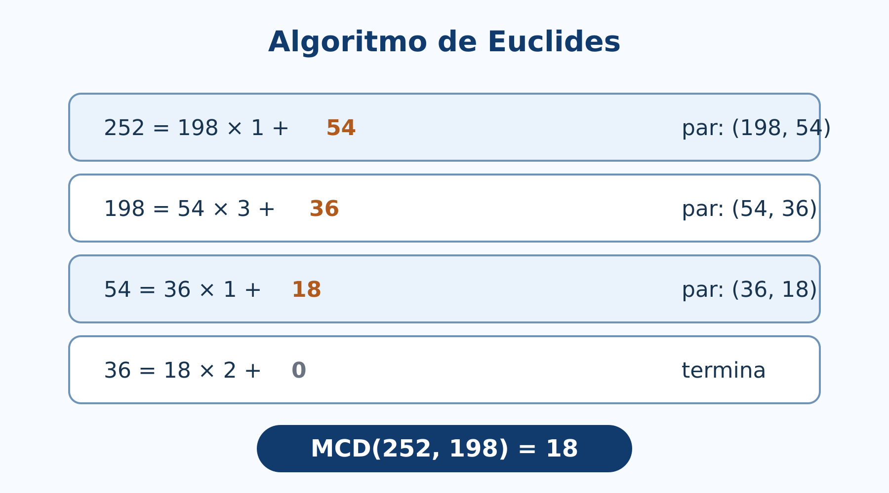
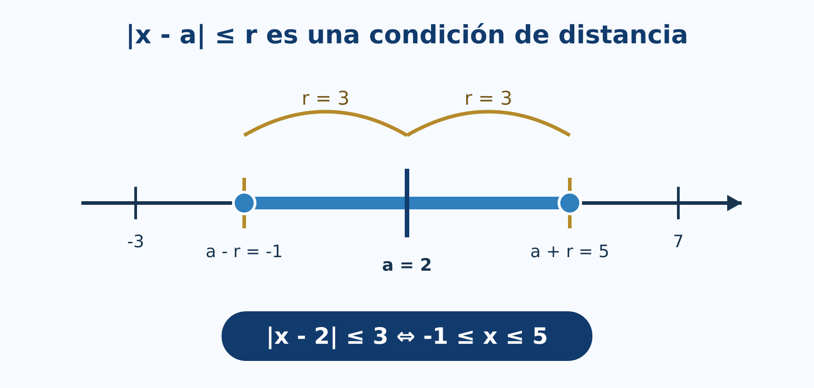

# Números enteros y reales

*Estructura, inducción, divisibilidad, primos, orden y distancia*

## Introducción {.unnumbered .unlisted}

Los números se aprenden primero como herramientas para contar y medir. En Álgebra Superior interesa además comprender **por qué** sus reglas funcionan, qué propiedades distinguen a cada sistema numérico y cómo se justifican afirmaciones que involucran infinitos casos.

El capítulo sigue la segunda unidad del programa de Álgebra Superior de la Facultad de Ciencias de la UASLP [@uaslp2011]. La exposición distingue con cuidado tres niveles: las propiedades que se aceptan como estructura, los teoremas que se deducen de ellas y los procedimientos que permiten calcular. La inducción, el algoritmo de Euclides y la factorización prima son ejemplos centrales de esta relación.

### Objetivos del capítulo {.unnumbered .unlisted}

Al finalizar, el lector será capaz de:

- reconocer las propiedades algebraicas y de orden de los enteros;
- demostrar afirmaciones mediante inducción simple y fuerte;
- aplicar el algoritmo de la división y el algoritmo de Euclides;
- trabajar con divisibilidad, máximo común divisor y mínimo común múltiplo;
- justificar la existencia y unicidad de la factorización prima;
- distinguir números naturales, enteros, racionales, irracionales y reales;
- utilizar las propiedades de campo ordenado y la completitud de los reales;
- operar correctamente con exponentes enteros, negativos y racionales;
- interpretar el valor absoluto como distancia y resolver ecuaciones e inecuaciones.

::: {.callout-tip title="Pregunta inicial"}
¿Cómo puede demostrarse que $1+3+5+\cdots +(2n-1)=n^2$ para **todo** entero positivo $n$? ¿Por qué el algoritmo que divide repetidamente permite calcular $\gcd(252,198)$? ¿Qué diferencia estructural existe entre $\mathbb Q$ y $\mathbb R$? Este capítulo desarrolla las herramientas para responder estas preguntas.
:::

## Propiedades de los números enteros {#sec-propiedades-enteros}

### El conjunto de los enteros {.unnumbered .unlisted}

Denotamos por

$$
\mathbb Z=\{\ldots,-3,-2,-1,0,1,2,3,\ldots\}
$$

el conjunto de los números enteros. Los enteros positivos se utilizan para contar; el cero expresa ausencia o referencia, y los enteros negativos permiten representar desplazamientos, deudas, temperaturas bajo cero y operaciones inversas de la suma.

La relación de inclusión entre los primeros sistemas numéricos es

$$
\mathbb N\subseteq\mathbb Z\subseteq\mathbb Q\subseteq\mathbb R.
$$

En este libro tomaremos $\mathbb N=\{1,2,3,\ldots\}$ y escribiremos $\mathbb N_0=\mathbb N\cup\{0\}$ cuando sea necesario incluir el cero.

### Propiedades algebraicas {.unnumbered .unlisted}

Para cualesquiera $a,b,c\in\mathbb Z$ se cumplen las propiedades siguientes.

| Propiedad | Suma | Producto |
|---|---|---|
| Cerradura | $a+b\in\mathbb Z$ | $ab\in\mathbb Z$ |
| Conmutatividad | $a+b=b+a$ | $ab=ba$ |
| Asociatividad | $(a+b)+c=a+(b+c)$ | $(ab)c=a(bc)$ |
| Elemento neutro | $a+0=a$ | $a\cdot1=a$ |
| Inverso | $a+(-a)=0$ | solo $1$ y $-1$ tienen inverso entero |

: Propiedades básicas de las operaciones en $\mathbb Z$. {#tbl-propiedades-enteros}

La suma y el producto se relacionan mediante la propiedad distributiva:

$$
a(b+c)=ab+ac.
$$

Los enteros forman un **anillo conmutativo con identidad**. No forman un campo, porque un entero distinto de $1$ y $-1$ no tiene inverso multiplicativo dentro de $\mathbb Z$. Por ejemplo, el inverso de $2$ es $1/2$, que no es entero.

### Orden y principio del buen orden {.unnumbered .unlisted}

El orden en $\mathbb Z$ es total: dados $a,b\in\mathbb Z$, exactamente una de estas afirmaciones es verdadera:

$$
a<b,\qquad a=b,\qquad a>b.
$$

El orden es compatible con las operaciones:

- si $a<b$, entonces $a+c<b+c$;
- si $a<b$ y $c>0$, entonces $ac<bc$;
- si $a<b$ y $c<0$, entonces $ac>bc$.

::: {.callout-note title="Principio del buen orden"}
Todo subconjunto no vacío de $\mathbb N$ posee un elemento mínimo.
:::

Este principio parece elemental, pero sostiene demostraciones importantes. Por ejemplo, permite justificar el algoritmo de la división y es equivalente, en un sentido lógico preciso, al principio de inducción.

### Consecuencias útiles {.unnumbered .unlisted}

Las reglas de signos no son convenciones aisladas: se deducen de las propiedades anteriores. Como

$$
0=a\cdot0=a(0+0)=a\cdot0+a\cdot0,
$$

al sumar el inverso de $a\cdot0$ en ambos lados se obtiene $a\cdot0=0$. Además,

$$
0=(-a)(b+(-b))=(-a)b+(-a)(-b),
$$

y como $(-a)b=-(ab)$, resulta

$$
(-a)(-b)=ab.
$$

## Inducción matemática {#sec-induccion}

### Idea fundamental {.unnumbered .unlisted}

Una afirmación $P(n)$ puede verificarse para muchos valores particulares sin quedar demostrada para todos los naturales. La **inducción matemática** permite pasar de un caso inicial a una cadena infinita de casos.

::: {.callout-note title="Principio de inducción"}
Sea $P(n)$ una proposición definida para todo $n\ge n_0$. Si:

1. $P(n_0)$ es verdadera, y
2. para todo $k\ge n_0$, la verdad de $P(k)$ implica la verdad de $P(k+1)$,

entonces $P(n)$ es verdadera para todo $n\ge n_0$.
:::

La afirmación $P(k)$ que se supone temporalmente verdadera se llama **hipótesis inductiva**. No se está suponiendo la conclusión completa; se demuestra una implicación: $P(k)\Rightarrow P(k+1)$.

{#fig-induccion-impares width=88%}

### Ejemplo: suma de los primeros impares {.unnumbered .unlisted}

Demostremos que

$$
1+3+5+\cdots +(2n-1)=n^2
$$

para todo $n\in\mathbb N$.

**Caso base.** Para $n=1$,

$$
1=1^2.
$$

**Hipótesis inductiva.** Supongamos que para algún $k\ge1$,

$$
1+3+\cdots +(2k-1)=k^2.
$$

**Paso inductivo.** Al agregar el siguiente impar, $2(k+1)-1=2k+1$, obtenemos

$$
\begin{aligned}
1+3+\cdots +(2k-1)+(2k+1)
&=k^2+2k+1\\
&=(k+1)^2.
\end{aligned}
$$

Por inducción, la igualdad se cumple para todo $n\ge1$.

### Otro ejemplo: suma geométrica {.unnumbered .unlisted}

Para $r\ne1$ y $n\in\mathbb N_0$,

$$
1+r+r^2+\cdots+r^n=\frac{r^{n+1}-1}{r-1}.
$$

El caso $n=0$ produce $1=(r-1)/(r-1)$. Si la fórmula vale para $n=k$, entonces

$$
\begin{aligned}
1+r+\cdots+r^k+r^{k+1}
&=\frac{r^{k+1}-1}{r-1}+r^{k+1}\\
&=\frac{r^{k+2}-1}{r-1}.
\end{aligned}
$$

### Inducción fuerte {.unnumbered .unlisted}

En la inducción fuerte, para demostrar $P(k+1)$ se permite utilizar todos los casos anteriores:

$$
P(n_0),P(n_0+1),\ldots,P(k).
$$

Es especialmente útil cuando un objeto se descompone en partes menores. Por ejemplo, para demostrar que todo entero $n>1$ es primo o producto de primos, si $n$ no es primo se escribe $n=ab$ con $1<a,b<n$ y se aplica la hipótesis fuerte a $a$ y $b$.

::: {.callout-warning title="Errores frecuentes en inducción"}
- Comprobar solo varios valores y llamarlo demostración.
- Omitir el caso base.
- Usar en el paso inductivo una fórmula distinta de la hipótesis.
- Transformar únicamente el lado derecho sin conectar la expresión de $k$ con la de $k+1$.
:::

## Divisibilidad {#sec-divisibilidad}

### Definición y propiedades {.unnumbered .unlisted}

Sean $a,b\in\mathbb Z$ con $a\ne0$. Decimos que **$a$ divide a $b$**, y escribimos $a\mid b$, si existe $k\in\mathbb Z$ tal que

$$
b=ak.
$$

Si no existe tal entero, escribimos $a\nmid b$. Por ejemplo, $7\mid42$ porque $42=7\cdot6$, mientras que $7\nmid40$.

Si $a\mid b$ y $a\mid c$, entonces para cualesquiera $m,n\in\mathbb Z$,

$$
a\mid(mb+nc).
$$

En efecto, si $b=ar$ y $c=as$, entonces $mb+nc=a(mr+ns)$.

### Algoritmo de la división {.unnumbered .unlisted}

::: {.callout-note title="Teorema: algoritmo de la división"}
Dados $a\in\mathbb Z$ y $d\in\mathbb Z$ con $d>0$, existen enteros únicos $q$ y $r$ tales que

$$
a=dq+r,\qquad 0\le r<d.
$$

$q$ es el cociente y $r$ el residuo.
:::

Por ejemplo,

$$
47=6(7)+5,
$$

de modo que el cociente es $7$ y el residuo es $5$. Para un dividendo negativo debe conservarse la condición $0\le r<d$:

$$
-47=6(-8)+1.
$$

### Máximo común divisor y algoritmo de Euclides {.unnumbered .unlisted}

El **máximo común divisor** de enteros $a$ y $b$, no ambos cero, es el mayor entero positivo que divide a ambos. Se denota por $\gcd(a,b)$.

Si

$$
a=bq+r,
$$

entonces los divisores comunes de $a$ y $b$ son exactamente los divisores comunes de $b$ y $r$. Por tanto,

$$
\gcd(a,b)=\gcd(b,r).
$$

Esta igualdad origina el algoritmo de Euclides. Para $252$ y $198$:

$$
\begin{aligned}
252&=198(1)+54,\\
198&=54(3)+36,\\
54&=36(1)+18,\\
36&=18(2)+0.
\end{aligned}
$$

El último residuo no nulo es $18$, por lo que $\gcd(252,198)=18$.

{#fig-algoritmo-euclides width=88%}

### Identidad de Bézout {.unnumbered .unlisted}

El máximo común divisor puede expresarse como combinación lineal:

$$
\gcd(a,b)=ax+by
$$

para ciertos $x,y\in\mathbb Z$. Al recorrer hacia atrás el ejemplo,

$$
18=54-36=54-(198-3\cdot54)=4\cdot54-198=4\cdot252-5\cdot198.
$$

Así, $x=4$ y $y=-5$ son coeficientes de Bézout.

## Números primos y factorización {#sec-primos-factorizacion}

### Primos y compuestos {.unnumbered .unlisted}

Un entero $p>1$ es **primo** si sus únicos divisores positivos son $1$ y $p$. Un entero mayor que $1$ que no es primo se llama **compuesto**. El número $1$ no es primo ni compuesto.

Para decidir si $n>1$ es primo basta probar divisores primos no mayores que $\sqrt n$. Si $n=ab$ y ambos factores fueran mayores que $\sqrt n$, entonces $ab>n$, lo cual es imposible.

### Lema de Euclides y teorema fundamental {.unnumbered .unlisted}

::: {.callout-note title="Lema de Euclides"}
Si $p$ es primo y $p\mid ab$, entonces $p\mid a$ o $p\mid b$.
:::

::: {.callout-note title="Teorema fundamental de la aritmética"}
Todo entero $n>1$ puede expresarse como producto de números primos. Esa factorización es única, salvo el orden de los factores.
:::

La existencia puede demostrarse por inducción fuerte. La unicidad se apoya en el lema de Euclides. Por ejemplo,

$$
756=2^2\cdot3^3\cdot7.
$$

{#fig-arbol-factorizacion width=82%}

### MCD y MCM mediante exponentes primos {.unnumbered .unlisted}

Si

$$
a=\prod_p p^{\alpha_p},\qquad b=\prod_p p^{\beta_p},
$$

entonces

$$
\gcd(a,b)=\prod_p p^{\min(\alpha_p,\beta_p)},
$$

y

$$
\operatorname{mcm}(a,b)=\prod_p p^{\max(\alpha_p,\beta_p)}.
$$

Para $a,b>0$ se cumple además

$$
\gcd(a,b)\operatorname{mcm}(a,b)=ab.
$$

### Infinitud de los primos {.unnumbered .unlisted}

Supongamos que solo existieran los primos $p_1,\ldots,p_n$ y consideremos

$$
N=p_1p_2\cdots p_n+1.
$$

Ningún $p_i$ divide a $N$, porque el residuo sería $1$. Sin embargo, $N>1$ debe ser primo o tener un divisor primo. En ambos casos aparece un primo que no estaba en la lista, contradicción. Por tanto, existen infinitos números primos.

## Números racionales y números reales {#sec-racionales-reales}

### Racionales {.unnumbered .unlisted}

Un número racional es un cociente de enteros:

$$
\mathbb Q=\left\{\frac ab:a,b\in\mathbb Z,\ b\ne0\right\}.
$$

Fracciones distintas pueden representar el mismo racional; por ejemplo,

$$
\frac12=\frac24=\frac{-3}{-6}.
$$

Todo racional posee una expansión decimal finita o periódica. Recíprocamente, toda expansión decimal finita o periódica representa un racional.

### Irracionales y reales {.unnumbered .unlisted}

Los números que no son racionales se llaman **irracionales**. Ejemplos clásicos son $\sqrt2$, $\pi$ y $e$. Los números reales reúnen racionales e irracionales:

$$
\mathbb R=\mathbb Q\cup(\mathbb R\setminus\mathbb Q).
$$

{#fig-jerarquia-numeros width=92%}

Demostremos que $\sqrt2$ es irracional. Supongamos que $\sqrt2=a/b$ en forma irreducible. Entonces

$$
a^2=2b^2.
$$

Por tanto, $a^2$ es par y $a$ también es par; escribamos $a=2k$. Sustituyendo,

$$
4k^2=2b^2\quad\Longrightarrow\quad b^2=2k^2,
$$

así que $b$ también es par. Esto contradice que $a/b$ estuviera reducida. Luego $\sqrt2\notin\mathbb Q$.

### Densidad {.unnumbered .unlisted}

Entre dos números reales distintos siempre existe un racional y también un irracional. En particular, si $a<b$, entonces su punto medio

$$
\frac{a+b}{2}
$$

está entre ambos, aunque no necesariamente sea racional cuando $a$ y $b$ son reales arbitrarios. La densidad muestra que racionales e irracionales están entrelazados en la recta real.

## Propiedades de los números reales {#sec-propiedades-reales}

### Campo ordenado {.unnumbered .unlisted}

Los reales forman un **campo ordenado**. Además de las propiedades de suma y producto vistas para los enteros, todo $a\ne0$ tiene inverso multiplicativo $a^{-1}=1/a$ en $\mathbb R$. El orden es compatible con las operaciones.

Una consecuencia importante es que todo cuadrado es no negativo. Si $x\ge0$, entonces $x^2\ge0$. Si $x<0$, entonces $-x>0$ y $x^2=(-x)^2>0$. De aquí se obtiene, por ejemplo, que

$$
x^2+1>0
$$

para todo $x\in\mathbb R$.

### Completitud {.unnumbered .unlisted}

La propiedad que distingue a $\mathbb R$ de $\mathbb Q$ es la **completitud**.

::: {.callout-note title="Axioma del supremo"}
Todo subconjunto no vacío de $\mathbb R$ que está acotado superiormente posee un supremo en $\mathbb R$.
:::

El supremo de un conjunto $A$ es su menor cota superior. No tiene que pertenecer a $A$. Por ejemplo,

$$
A=\{x\in\mathbb R:x<2\}
$$

tiene supremo $2$, pero $2\notin A$.

En $\mathbb Q$ la completitud falla: el conjunto

$$
\{q\in\mathbb Q:q^2<2\}
$$

está acotado superiormente, pero no tiene supremo racional.

### Propiedad arquimediana e intervalos {.unnumbered .unlisted}

Para todo real $x$ existe $n\in\mathbb N$ tal que $n>x$. Esta propiedad impide que existan reales infinitamente grandes o infinitesimales distintos de cero dentro del sistema usual.

Los intervalos expresan conjuntos definidos por desigualdades:

| Desigualdad | Intervalo |
|---|---|
| $a<x<b$ | $(a,b)$ |
| $a\le x\le b$ | $[a,b]$ |
| $a<x\le b$ | $(a,b]$ |
| $x\ge a$ | $[a,\infty)$ |

: Correspondencia entre desigualdades e intervalos. {#tbl-intervalos}

Al multiplicar una desigualdad por un número negativo se invierte su sentido. Por ejemplo,

$$
-3x<12\quad\Longleftrightarrow\quad x>-4.
$$

## Exponentes racionales y negativos {#sec-exponentes}

### Exponentes enteros {.unnumbered .unlisted}

Para $a\ne0$ y $n\in\mathbb N$ se define

$$
a^{-n}=\frac1{a^n},\qquad a^0=1.
$$

Estas definiciones conservan la ley $a^m a^n=a^{m+n}$. El caso $0^0$ no se define de manera universal en álgebra elemental, y $0^{-n}$ no existe.

### Exponentes racionales {.unnumbered .unlisted}

Sea $m/n$ una fracción reducida con $n>0$. Para $a>0$ definimos

$$
a^{m/n}=\sqrt[n]{a^m}=\left(\sqrt[n]{a}\right)^m.
$$

Si $n$ es impar, la definición puede extenderse a bases negativas. Si $n$ es par, una base negativa no produce un número real. Así,

$$
(-8)^{1/3}=-2,\qquad (-8)^{1/2}\notin\mathbb R.
$$

### Leyes y restricciones {.unnumbered .unlisted}

Para bases positivas y exponentes racionales se cumplen

$$
a^r a^s=a^{r+s},\qquad \frac{a^r}{a^s}=a^{r-s},
$$

$$
(a^r)^s=a^{rs},\qquad (ab)^r=a^r b^r.
$$

Las restricciones de signo no son detalles menores. Por ejemplo,

$$
\sqrt{x^2}=|x|,
$$

no $x$ para todo real $x$. Si $x=-3$, entonces $\sqrt{x^2}=3\ne-3$.

::: {.callout-warning title="Error frecuente"}
En general,
$$
\sqrt{a+b}\ne\sqrt a+\sqrt b.
$$
Con $a=b=1$, el lado izquierdo es $\sqrt2$ y el derecho es $2$.
:::

## Valor absoluto {#sec-valor-absoluto}

### Definición y significado geométrico {.unnumbered .unlisted}

El valor absoluto de $x\in\mathbb R$ se define por

$$
|x|=
\begin{cases}
x, & x\ge0,\\
-x, & x<0.
\end{cases}
$$

Geométricamente, $|x|$ es la distancia de $x$ al origen y $|x-a|$ es la distancia entre $x$ y $a$.

{#fig-valor-absoluto width=90%}

### Propiedades {.unnumbered .unlisted}

Para $x,y\in\mathbb R$:

$$
|x|\ge0,\qquad |x|=0\Longleftrightarrow x=0,
$$

$$
|xy|=|x||y|,\qquad \left|\frac xy\right|=\frac{|x|}{|y|}\quad(y\ne0),
$$

$$
|x+y|\le|x|+|y|.
$$

La última expresión es la **desigualdad triangular**. Como

$$
-|x|\le x\le|x|,
$$

y análogamente para $y$, al sumar se obtiene

$$
-(|x|+|y|)\le x+y\le |x|+|y|,
$$

lo que implica $|x+y|\le|x|+|y|$.

### Ecuaciones e inecuaciones {.unnumbered .unlisted}

Para $r>0$:

$$
|x-a|=r\quad\Longleftrightarrow\quad x=a-r\text{ o }x=a+r,
$$

$$
|x-a|<r\quad\Longleftrightarrow\quad a-r<x<a+r,
$$

$$
|x-a|>r\quad\Longleftrightarrow\quad x<a-r\text{ o }x>a+r.
$$

Ejemplo:

$$
|2x-3|\le5
$$

equivale a

$$
-5\le2x-3\le5,
$$

por lo que

$$
-1\le x\le4.
$$

## Síntesis del capítulo {.unnumbered .unlisted}

- Los enteros son cerrados bajo suma, resta y producto, pero no bajo división.
- La inducción demuestra una cadena infinita de afirmaciones a partir de un caso base y un paso inductivo.
- El algoritmo de la división produce cociente y residuo únicos.
- El algoritmo de Euclides calcula el MCD mediante residuos sucesivos.
- Todo entero mayor que uno tiene una factorización prima única.
- Los racionales tienen expansión decimal finita o periódica; los irracionales completan la recta real.
- Los reales forman un campo ordenado completo.
- Los exponentes racionales requieren atender a dominio, signo y paridad del índice.
- El valor absoluto mide distancia y convierte problemas geométricos en desigualdades.

## Errores frecuentes {.unnumbered .unlisted}

1. Confundir comprobar muchos casos con demostrar por inducción.
2. Dividir una desigualdad por un número negativo sin invertir el signo.
3. Afirmar que $a\mid b$ significa solamente que $b/a$ puede calcularse; el cociente debe ser entero.
4. Considerar primo al número $1$.
5. Detener el algoritmo de Euclides en el residuo cero en vez de tomar el último residuo no nulo.
6. Suponer que todo decimal es racional; debe ser finito o periódico.
7. Usar $\sqrt{x^2}=x$ sin considerar $x<0$.
8. Aplicar leyes de exponentes sin revisar las restricciones de la base.
9. Interpretar $|x-a|>r$ como un intervalo central; describe dos regiones exteriores.

## Ejercicios {.unnumbered .unlisted}

### Nivel básico {.unnumbered .unlisted}

1. Clasifique como naturales, enteros, racionales, irracionales o reales: $-7$, $0$, $3/5$, $\sqrt{49}$, $\sqrt7$ y $\pi$.
2. Use las propiedades de orden para resolver $5-3x\le17$.
3. Calcule cociente y residuo al dividir $137$ entre $12$ y $-137$ entre $12$.
4. Determine si $11\mid341$ y si $13\mid341$.
5. Factorice $1386$ en primos.
6. Simplifique $2^{-3}4^{3/2}$.
7. Resuelva $|x-4|=7$ y $|x-4|<7$.

### Nivel intermedio {.unnumbered .unlisted}

8. Demuestre por inducción que $1+2+\cdots+n=n(n+1)/2$.
9. Demuestre por inducción que $7\mid(8^n-1)$ para todo $n\ge1$.
10. Use el algoritmo de Euclides para calcular $\gcd(414,662)$ y exprese el resultado como combinación lineal.
11. Calcule $\gcd(840,378)$ y $\operatorname{mcm}(840,378)$ mediante factorización prima.
12. Demuestre que si $a\mid b$ y $b\mid a$, entonces $a=\pm b$.
13. Demuestre que entre dos racionales distintos existe otro racional.
14. Resuelva $|3x+2|>8$ y exprese la solución con intervalos.

### Nivel formal y aplicado {.unnumbered .unlisted}

15. Demuestre por inducción fuerte que todo entero $n>1$ es primo o producto de primos.
16. Pruebe que si $\gcd(a,b)=1$ y $a\mid bc$, entonces $a\mid c$.
17. Demuestre que existen infinitos primos de la forma necesaria para refutar cualquier lista finita de todos los primos.
18. Justifique por qué $\sqrt3$ es irracional adaptando la demostración de $\sqrt2$.
19. Pruebe la desigualdad triangular inversa:
$$
\bigl||x|-|y|\bigr|\le|x-y|.
$$
20. Describa el conjunto de números que están a distancia mayor que $2$ de $-1$ y represéntelo en la recta real.

## Respuestas breves a ejercicios seleccionados {.unnumbered .unlisted}

1. $-7$ es entero; $0$ es entero y racional; $3/5$ es racional; $\sqrt{49}=7$ es natural; $\sqrt7$ y $\pi$ son irracionales. Todos son reales.
3. $137=12(11)+5$ y $-137=12(-12)+7$.
4. $11\mid341$ porque $341=11\cdot31$; también $341=13\cdot26+3$, así que $13\nmid341$.
5. $1386=2\cdot3^2\cdot7\cdot11$.
6. $2^{-3}4^{3/2}=2^{-3}(2^2)^{3/2}=2^{-3}2^3=1$.
7. $x=-3$ o $x=11$; para la desigualdad, $-3<x<11$.
10. $\gcd(414,662)=2$.
14. $x<-10/3$ o $x>2$.

## Proyecto integrador {.unnumbered .unlisted}

Construya un estudio completo de dos enteros positivos $a$ y $b$ elegidos por el equipo:

1. aplique el algoritmo de Euclides paso a paso;
2. obtenga coeficientes de Bézout;
3. factorice ambos números en primos;
4. calcule MCD y MCM mediante exponentes primos;
5. verifique $\gcd(a,b)\operatorname{mcm}(a,b)=ab$;
6. formule una conjetura de divisibilidad relacionada con los datos;
7. demuestre la conjetura o construya un contraejemplo;
8. presente una representación visual clara de los resultados.

## Referencias del capítulo {.unnumbered .unlisted}

La secuencia corresponde a la segunda unidad del programa de Álgebra Superior [@uaslp2011]. Las propiedades de los sistemas numéricos, la inducción y las desigualdades se apoyan en @silvaLazo2007 y @rosen2019. Para divisibilidad, algoritmos y factorización se consultaron @burton2011 y @niven1991.
