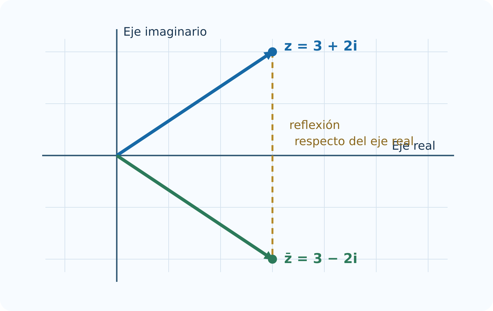

# Números complejos

Este capítulo desarrolla la Unidad 3 del programa oficial de Álgebra Superior de la Facultad de Ciencias de la UASLP [@uaslp2011]. La idea central es construir los números complejos a partir del plano real: primero se estudia $\mathbb R^2$, después se dota a los pares ordenados de una multiplicación especial y, finalmente, se interpreta cada operación en forma algebraica y geométrica.

## Introducción {.unnumbered .unlisted}

En $\mathbb R$ la ecuación $x^2+1=0$ no tiene solución, porque $x^2\geq 0$ para todo número real. Para resolverla sin perder las leyes usuales del álgebra es necesario ampliar el sistema numérico. Esa ampliación es $\mathbb C$, el conjunto de los números complejos.

La construcción no surge de un símbolo misterioso. Un número complejo puede entenderse como un par $(a,b)\in\mathbb R^2$ con reglas precisas para sumar y multiplicar. La forma $a+bi$ resume ese par, y la identidad $i^2=-1$ es una consecuencia de la multiplicación definida en el plano.

### Objetivos del capítulo {.unnumbered .unlisted}

Al terminar el capítulo, el lector podrá:

- describir puntos y vectores de $\mathbb R^2$;
- convertir entre coordenadas cartesianas y polares;
- operar vectores y justificar sus propiedades;
- calcular módulo y argumento;
- construir $\mathbb C$ a partir de $\mathbb R^2$;
- sumar, restar, multiplicar y dividir números complejos;
- utilizar el conjugado y demostrar sus propiedades;
- calcular potencias mediante la fórmula de De Moivre;
- obtener todas las raíces $n$-ésimas de un complejo;
- relacionar las operaciones algebraicas con movimientos del plano.

## Definición de $\mathbb R^2$ {#sec-r2}

::: {.callout-note title="Definición"}
El plano real es el producto cartesiano

$$
\mathbb R^2=\mathbb R\times\mathbb R
=\{(x,y):x\in\mathbb R,\ y\in\mathbb R\}.
$$

Dos pares son iguales si y solo si coinciden sus componentes:

$$
(x,y)=(u,v)\iff x=u\ \text{y}\ y=v.
$$
:::

Un par $(x,y)$ puede interpretarse como un **punto** del plano o como el **vector** que parte del origen y termina en ese punto. El contexto determina la interpretación, pero los cálculos con sus componentes son los mismos.

Los vectores

$$
\mathbf e_1=(1,0),\qquad \mathbf e_2=(0,1)
$$

forman la base canónica. Todo vector $\mathbf v=(x,y)$ tiene una expresión única

$$
\mathbf v=x\mathbf e_1+y\mathbf e_2.
$$

### Ejes, cuadrantes y distancia {.unnumbered .unlisted}

El eje horizontal corresponde a los puntos $(x,0)$ y el vertical a $(0,y)$. Los signos de $x$ y $y$ determinan los cuatro cuadrantes.

Por el teorema de Pitágoras, la distancia de $P=(x,y)$ a $Q=(u,v)$ es

$$
d(P,Q)=\sqrt{(x-u)^2+(y-v)^2}.
$$

En particular, la longitud del vector $(x,y)$ es $\sqrt{x^2+y^2}$.

::: {.callout-tip title="Ejemplo"}
Si $P=(-2,3)$ y $Q=(4,-1)$, entonces

$$
d(P,Q)=\sqrt{(-2-4)^2+(3+1)^2}=\sqrt{52}=2\sqrt{13}.
$$
:::

## Representaciones cartesiana y polar de vectores en $\mathbb R^2$ {#sec-cartesiana-polar}

La representación cartesiana $(x,y)$ indica cuánto se avanza horizontal y verticalmente. La representación polar $(r,\theta)$ indica una distancia al origen y un ángulo medido desde el eje positivo $x$.

Para $(x,y)\neq(0,0)$:

$$
r=\sqrt{x^2+y^2},\qquad
x=r\cos\theta,\qquad
y=r\sin\theta.
$$

Por tanto,

$$
\cos\theta=\frac{x}{r},\qquad
\sin\theta=\frac{y}{r}.
$$

El ángulo debe elegirse en el cuadrante correcto. La igualdad $\tan\theta=y/x$ no basta por sí sola, porque la tangente tiene periodo $\pi$ y no distingue puntos opuestos.

{#fig-plano-complejo width=78%}

### No unicidad del ángulo {.unnumbered .unlisted}

El mismo vector queda representado por

$$
(r,\theta),\ (r,\theta+2\pi),\ (r,\theta-2\pi),\ldots
$$

En general, todos sus ángulos son $\theta+2k\pi$, con $k\in\mathbb Z$. Para evitar ambigüedad se elige un **argumento principal**, usualmente en $(-\pi,\pi]$.

::: {.callout-warning title="Caso especial"}
El origen tiene radio $r=0$, pero no tiene un ángulo determinado. Cualquier dirección termina en el mismo punto cuando la distancia es cero.
:::

### Ejemplo resuelto {.unnumbered .unlisted}

Para el vector $(-\sqrt3,1)$:

$$
r=\sqrt{3+1}=2.
$$

Como está en el segundo cuadrante y

$$
\cos\theta=-\frac{\sqrt3}{2},\qquad \sin\theta=\frac12,
$$

se obtiene $\theta=5\pi/6$. Su forma polar principal es $(2,5\pi/6)$.

## Operaciones con vectores en $\mathbb R^2$ {#sec-operaciones-r2}

Sean $\mathbf u=(u_1,u_2)$, $\mathbf v=(v_1,v_2)$ y $\lambda\in\mathbb R$.

::: {.callout-note title="Definiciones"}
$$
\begin{aligned}
\mathbf u+\mathbf v&=(u_1+v_1,u_2+v_2),\\
\mathbf u-\mathbf v&=(u_1-v_1,u_2-v_2),\\
\lambda\mathbf u&=(\lambda u_1,\lambda u_2),\\
\mathbf u\cdot\mathbf v&=u_1v_1+u_2v_2.
\end{aligned}
$$
:::

La suma obedece la regla del paralelogramo. Al colocar dos copias de $\mathbf u$ y $\mathbf v$ con el mismo origen, la diagonal del paralelogramo es $\mathbf u+\mathbf v$.

{#fig-suma-vectores width=78%}

### Propiedades algebraicas {.unnumbered .unlisted}

Para cualesquiera $\mathbf u,\mathbf v,\mathbf w\in\mathbb R^2$ y $\lambda,\mu\in\mathbb R$:

$$
\begin{aligned}
\mathbf u+\mathbf v&=\mathbf v+\mathbf u,\\
(\mathbf u+\mathbf v)+\mathbf w&=\mathbf u+(\mathbf v+\mathbf w),\\
\mathbf u+\mathbf 0&=\mathbf u,\\
\mathbf u+(-\mathbf u)&=\mathbf 0,\\
\lambda(\mathbf u+\mathbf v)&=\lambda\mathbf u+\lambda\mathbf v,\\
(\lambda+\mu)\mathbf u&=\lambda\mathbf u+\mu\mathbf u,\\
(\lambda\mu)\mathbf u&=\lambda(\mu\mathbf u),\\
1\mathbf u&=\mathbf u.
\end{aligned}
$$

Todas se demuestran comparando componentes. Por ejemplo,

$$
\lambda(\mathbf u+\mathbf v)
=(\lambda(u_1+v_1),\lambda(u_2+v_2))
=\lambda\mathbf u+\lambda\mathbf v.
$$

### Producto punto y perpendicularidad {.unnumbered .unlisted}

Si $\varphi$ es el ángulo entre dos vectores no nulos, entonces

$$
\mathbf u\cdot\mathbf v=|\mathbf u\|\|\mathbf v\|\cos\varphi.
$$

De aquí se deduce que $\mathbf u\perp\mathbf v$ si y solo si $\mathbf u\cdot\mathbf v=0$.

::: {.callout-tip title="Ejemplo"}
Para $\mathbf u=(2,1)$ y $\mathbf v=(-1,2)$,

$$
\mathbf u\cdot\mathbf v=2(-1)+1(2)=0.
$$

Por tanto, los vectores son perpendiculares.
:::

## Módulo y argumento {#sec-modulo-argumento}

Para un vector $\mathbf v=(x,y)$ se define su módulo o norma euclidiana como

$$
\|\mathbf v\|=\sqrt{x^2+y^2}.
$$

Si $\mathbf v\neq\mathbf 0$, un argumento de $\mathbf v$ es cualquier ángulo $\theta$ que cumple

$$
\mathbf v=\|\mathbf v\|(\cos\theta,\sin\theta).
$$

### Propiedades del módulo {.unnumbered .unlisted}

Para $\mathbf u,\mathbf v\in\mathbb R^2$ y $\lambda\in\mathbb R$:

$$
\begin{aligned}
\|\mathbf v\|&\geq 0,\\
\|\mathbf v\|=0&\iff \mathbf v=\mathbf 0,\\
\|\lambda\mathbf v\|&=|\lambda|\,\|\mathbf v\|,\\
|\mathbf u\cdot\mathbf v|&\leq \|\mathbf u\|\|\mathbf v\|,\\
\|\mathbf u+\mathbf v\|&\leq \|\mathbf u\|+\|\mathbf v\|.
\end{aligned}
$$

La cuarta desigualdad es la de Cauchy-Schwarz y la quinta es la desigualdad triangular.

### Demostración de la desigualdad triangular {.unnumbered .unlisted}

Usando Cauchy-Schwarz:

$$
\begin{aligned}
\|\mathbf u+\mathbf v\|^2
&=(\mathbf u+\mathbf v)\cdot(\mathbf u+\mathbf v)\\
&=\|\mathbf u\|^2+2\mathbf u\cdot\mathbf v+\|\mathbf v\|^2\\
&\leq \|\mathbf u\|^2+2\|\mathbf u\|\|\mathbf v\|+\|\mathbf v\|^2\\
&=(\|\mathbf u\|+\|\mathbf v\|)^2.
\end{aligned}
$$

Ambos lados son no negativos; al extraer raíz cuadrada se obtiene el resultado.

## Números imaginarios y complejos {#sec-imaginarios-complejos}

Definimos en $\mathbb R^2$ una suma usual y una multiplicación nueva:

$$
(a,b)+(c,d)=(a+c,b+d),
$$

$$
(a,b)(c,d)=(ac-bd,ad+bc).
$$

Con estas operaciones, $\mathbb R^2$ se convierte en el campo de los números complejos $\mathbb C$.

Sea

$$
1=(1,0),\qquad i=(0,1).
$$

Entonces

$$
i^2=(0,1)(0,1)=(-1,0)=-1.
$$

Además,

$$
(a,b)=(a,0)+(0,b)=a(1,0)+b(0,1)=a+bi.
$$

::: {.callout-note title="Definición"}
Un número complejo es una expresión

$$
z=a+bi,\qquad a,b\in\mathbb R,\qquad i^2=-1.
$$

Se llama $a=\operatorname{Re}(z)$ a su parte real y $b=\operatorname{Im}(z)$ a su parte imaginaria.
:::

Dos complejos son iguales exactamente cuando coinciden sus partes:

$$
a+bi=c+di\iff a=c\ \text{y}\ b=d.
$$

Los reales están incluidos en $\mathbb C$ mediante $a=a+0i$. Un complejo de la forma $bi$ con $b\neq0$ se denomina imaginario puro.

## Operaciones básicas con números complejos {#sec-operaciones-complejos}

Sean $z=a+bi$ y $w=c+di$.

$$
\begin{aligned}
z+w&=(a+c)+(b+d)i,\\
z-w&=(a-c)+(b-d)i,\\
zw&=(ac-bd)+(ad+bc)i.
\end{aligned}
$$

La regla de multiplicación se obtiene distribuyendo y sustituyendo $i^2$ por $-1$:

$$
(a+bi)(c+di)=ac+adi+bci+bd i^2.
$$

::: {.callout-tip title="Ejemplo resuelto"}
Para $z=3-2i$ y $w=1+4i$:

$$
z+w=4+2i,
$$

$$
zw=3+12i-2i-8i^2=11+10i.
$$
:::

### Interpretación polar de la multiplicación {.unnumbered .unlisted}

Si

$$
z=r(\cos\alpha+i\sin\alpha),\qquad
w=s(\cos\beta+i\sin\beta),
$$

entonces, por las identidades de suma de ángulos,

$$
zw=rs\bigl(\cos(\alpha+\beta)+i\sin(\alpha+\beta)\bigr).
$$

Por tanto, multiplicar complejos significa **multiplicar módulos y sumar argumentos**. Geométricamente, multiplicar por $w$ produce una dilatación de factor $|w|$ y una rotación de ángulo $\arg(w)$.

### Ejemplo geométrico {.unnumbered .unlisted}

Multiplicar por $i$ conserva el módulo y suma $\pi/2$ al argumento. Por eso

$$
i(a+bi)=-b+ai
$$

representa una rotación de $90^\circ$ en sentido antihorario.

## Complejo conjugado y sus propiedades {#sec-conjugado}

::: {.callout-note title="Definición"}
El conjugado de $z=a+bi$ es

$$
\overline z=a-bi.
$$
:::

Geométricamente, la conjugación refleja el punto respecto del eje real.

{#fig-conjugado-complejo width=72%}

### Propiedades {.unnumbered .unlisted}

Para $z,w\in\mathbb C$:

$$
\begin{aligned}
\overline{\overline z}&=z,\\
\overline{z+w}&=\overline z+\overline w,\\
\overline{zw}&=\overline z\,\overline w,\\
z\overline z&=|z|^2,\\
|\overline z|&=|z|,\\
z\in\mathbb R&\iff z=\overline z.
\end{aligned}
$$

También permite recuperar las partes real e imaginaria:

$$
\operatorname{Re}(z)=\frac{z+\overline z}{2},
\qquad
\operatorname{Im}(z)=\frac{z-\overline z}{2i}.
$$

### Demostración de la propiedad multiplicativa {.unnumbered .unlisted}

Si $z=a+bi$ y $w=c+di$, entonces

$$
zw=(ac-bd)+(ad+bc)i.
$$

Por consiguiente,

$$
\overline{zw}=(ac-bd)-(ad+bc)i.
$$

Por otro lado,

$$
\overline z\,\overline w=(a-bi)(c-di)
=(ac-bd)-(ad+bc)i.
$$

Ambas expresiones son iguales.

## División de complejos {#sec-division-complejos}

Para dividir entre $w=c+di\neq0$ se multiplica numerador y denominador por $\overline w$:

$$
\frac{z}{w}
=\frac{z\overline w}{w\overline w}
=\frac{(a+bi)(c-di)}{c^2+d^2}.
$$

Así,

$$
\frac{a+bi}{c+di}
=\frac{ac+bd}{c^2+d^2}
+\frac{bc-ad}{c^2+d^2}i.
$$

El inverso de un complejo no nulo es

$$
z^{-1}=\frac{\overline z}{|z|^2}.
$$

::: {.callout-tip title="Ejemplo resuelto"}
$$
\frac{2+3i}{1-2i}
=\frac{(2+3i)(1+2i)}{(1-2i)(1+2i)}
=\frac{-4+7i}{5}
=-\frac45+\frac75i.
$$

La comprobación consiste en multiplicar el resultado por $1-2i$ y recuperar $2+3i$.
:::

### División en forma polar {.unnumbered .unlisted}

Si $z=r(\cos\alpha+i\sin\alpha)$ y $w=s(\cos\beta+i\sin\beta)$, con $s>0$, entonces

$$
\frac zw=\frac rs\bigl(\cos(\alpha-\beta)+i\sin(\alpha-\beta)\bigr).
$$

Dividir significa dividir módulos y restar argumentos.

## Potencias y raíces de complejos {#sec-potencias-raices}

### Fórmula de De Moivre {.unnumbered .unlisted}

Para $n\in\mathbb Z$ y

$$
z=r(\cos\theta+i\sin\theta),
$$

se cumple

$$
z^n=r^n\bigl(\cos(n\theta)+i\sin(n\theta)\bigr).
$$

Para $n\geq1$, la demostración se obtiene por inducción usando las fórmulas de suma del seno y el coseno. Para exponentes negativos se aplica el inverso.

::: {.callout-tip title="Ejemplo: una potencia grande"}
Como

$$
1+i=\sqrt2\left(\cos\frac\pi4+i\sin\frac\pi4\right),
$$

entonces

$$
(1+i)^8=(\sqrt2)^8\left(\cos2\pi+i\sin2\pi\right)=16.
$$
:::

### Raíces $n$-ésimas {.unnumbered .unlisted}

Sea

$$
z=r(\cos\theta+i\sin\theta),\qquad r>0.
$$

Las soluciones de $w^n=z$ son

$$
w_k=\sqrt[n]{r}\left[
\cos\left(\frac{\theta+2k\pi}{n}\right)
+i\sin\left(\frac{\theta+2k\pi}{n}\right)
\right],
$$

para $k=0,1,\ldots,n-1$.

Son exactamente $n$ puntos igualmente espaciados sobre la circunferencia de radio $\sqrt[n]{r}$.

### Raíces de la unidad {.unnumbered .unlisted}

Las soluciones de $w^n=1$ son

$$
\omega_k=\cos\frac{2k\pi}{n}+i\sin\frac{2k\pi}{n}
=e^{2k\pi i/n},
$$

con $k=0,\ldots,n-1$. Forman los vértices de un polígono regular inscrito en la circunferencia unitaria.

{#fig-raices-unidad width=72%}

::: {.callout-tip title="Ejemplo: raíces cúbicas de $-8$"}
Escribimos

$$
-8=8(\cos\pi+i\sin\pi).
$$

Las raíces son

$$
w_k=2\left[\cos\left(\frac{\pi+2k\pi}{3}\right)
+i\sin\left(\frac{\pi+2k\pi}{3}\right)\right],
\quad k=0,1,2.
$$

Por tanto,

$$
w_0=1+\sqrt3i,\qquad w_1=-2,\qquad w_2=1-\sqrt3i.
$$
:::

## Síntesis del capítulo {.unnumbered .unlisted}

- $\mathbb R^2$ está formado por pares ordenados y proporciona el modelo geométrico de $\mathbb C$.
- Las coordenadas cartesianas describen componentes; las polares describen módulo y argumento.
- La suma de complejos corresponde a suma vectorial.
- La multiplicación compleja multiplica módulos y suma argumentos.
- El conjugado refleja respecto del eje real y cumple $z\overline z=|z|^2$.
- La división utiliza el conjugado o, en forma polar, divide módulos y resta argumentos.
- De Moivre transforma potencias en multiplicación de ángulos.
- Toda raíz $n$-ésima no nula tiene $n$ valores igualmente espaciados.

## Errores frecuentes {.unnumbered .unlisted}

1. **Usar $\arctan(y/x)$ sin revisar el cuadrante.** Deben considerarse los signos de $x$ y $y$.
2. **Asignar argumento al cero.** El número $0$ no tiene argumento definido.
3. **Olvidar que $i^2=-1$.** Es la fuente principal de errores de signo al multiplicar.
4. **Conjugar solo una parte de una expresión.** Se cumple $\overline{z+w}=\overline z+\overline w$ y $\overline{zw}=\overline z\,\overline w$.
5. **Dividir componentes directamente.** En general, $(a+bi)/(c+di)$ no es $a/c+(b/d)i$.
6. **Dar una sola raíz $n$-ésima.** Para $z\neq0$ existen exactamente $n$ raíces distintas.
7. **Mezclar grados y radianes.** Las fórmulas analíticas se escriben normalmente en radianes.
8. **Confundir $|z|$ con $\operatorname{Re}(z)$.** El módulo siempre es real no negativo.

## Ejercicios {.unnumbered .unlisted}

### Nivel básico {.unnumbered .unlisted}

1. Ubique en el plano $(3,-2)$, $(-1,4)$, $(-3,-3)$ y $(0,5)$ e indique su cuadrante o eje.
2. Calcule la distancia entre $P=(2,-1)$ y $Q=(-4,7)$.
3. Convierta $(\sqrt3,1)$ y $(-1,-\sqrt3)$ a forma polar principal.
4. Convierta $(r,\theta)=(4,5\pi/6)$ a coordenadas cartesianas.
5. Sean $\mathbf u=(2,-3)$ y $\mathbf v=(-1,5)$. Calcule $\mathbf u+\mathbf v$, $2\mathbf u-\mathbf v$ y $\mathbf u\cdot\mathbf v$.
6. Calcule $|3-4i|$, $\operatorname{Re}(3-4i)$ y $\operatorname{Im}(3-4i)$.
7. Efectúe $(2+5i)+(-3+i)$ y $(2+5i)(-3+i)$.
8. Halle el conjugado de $-7+2i$ y compruebe $z\overline z=|z|^2$.

### Nivel intermedio {.unnumbered .unlisted}

9. Determine el argumento principal de $-2+2i$, $-3-3i$ y $4-4i$.
10. Pruebe por componentes que $\lambda(\mathbf u+\mathbf v)=\lambda\mathbf u+\lambda\mathbf v$.
11. Determine $x,y\in\mathbb R$ si $(2+i)(x+yi)=7-i$.
12. Simplifique $(1-i)^6$ mediante De Moivre y compruebe por multiplicación sucesiva.
13. Calcule $(3+4i)/(2-i)$ en forma cartesiana y polar.
14. Encuentre las cuatro raíces de $16$ y represéntelas en el plano.
15. Resuelva $z^3=8i$ y verifique cada resultado elevándolo al cubo.
16. Describa geométricamente la transformación $T(z)=(-1+i)z$.

### Nivel formal y aplicado {.unnumbered .unlisted}

17. Demuestre que $|z+w|\leq|z|+|w|$ usando $\operatorname{Re}(z\overline w)\leq|z||w|$.
18. Demuestre que $|z-w|\geq\bigl||z|-|w|\bigr|$.
19. Pruebe que $z+\overline z$ es real y $z-\overline z$ es imaginario puro.
20. Demuestre que las raíces de $z^n=1$ son cerradas bajo la multiplicación.
21. Si $|z|=1$, pruebe que $z^{-1}=\overline z$.
22. En corriente alterna, un fasor tiene magnitud $120$ y ángulo $-30^\circ$. Escríbalo en forma cartesiana y determine el resultado de multiplicarlo por un fasor de magnitud $2$ y ángulo $45^\circ$.

## Respuestas breves a ejercicios seleccionados {.unnumbered .unlisted}

2. $10$.

3. $(2,\pi/6)$ y $(2,-2\pi/3)$.

4. $(-2\sqrt3,2)$.

5. $(1,2)$, $(5,-11)$ y $-17$.

7. $-1+6i$ y $-11-13i$.

11. $x=13/5$, $y=-9/5$.

12. $8i$.

13. $\dfrac25+\dfrac{11}{5}i$.

14. $2$, $2i$, $-2$ y $-2i$.

21. De $|z|^2=z\overline z=1$ se sigue $z^{-1}=\overline z$.

22. Primer fasor: $60\sqrt3-60i$; producto: magnitud $240$ y ángulo $15^\circ$.

## Proyecto integrador {.unnumbered .unlisted}

**Transformaciones complejas y fasores.** Construya un informe que incluya:

1. tres números complejos en forma cartesiana y polar;
2. su representación en el plano;
3. una transformación $T(z)=az$ interpretada como rotación y cambio de escala;
4. la comprobación algebraica de módulos y argumentos;
5. las raíces cuartas de uno de los complejos;
6. una aplicación breve a fasores, señales sinusoidales o rotaciones bidimensionales;
7. una conclusión que conecte la geometría con las operaciones.

## Referencias del capítulo {.unnumbered .unlisted}

La secuencia sigue la Unidad 3 del programa oficial [@uaslp2011]. Para ampliar la teoría y la interpretación geométrica pueden consultarse @silvaLazo2007, @brownChurchill2014 y @needham1997.
