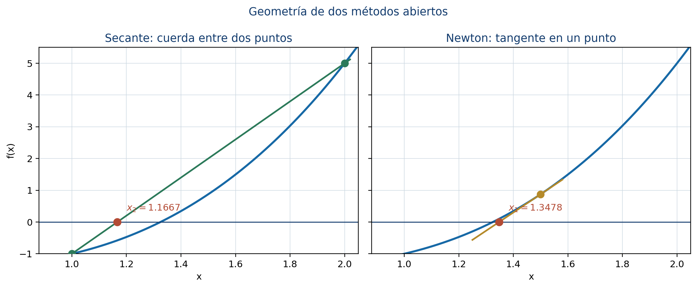

# Métodos numéricos para la estimación de raíces

Este capítulo desarrolla la Unidad 5 del programa de Álgebra Superior de la Facultad de Ciencias de la UASLP [@uaslp2011]. El Teorema Fundamental del Álgebra garantiza que un polinomio no constante posee raíces complejas, pero no indica dónde se encuentran ni cómo calcularlas. Aquí se estudian herramientas para **acotar**, **contar**, **separar** y **aproximar** las raíces reales de un polinomio.

## Introducción {.unnumbered .unlisted}

Sea

$$
p(x)=a_nx^n+a_{n-1}x^{n-1}+\cdots+a_1x+a_0,
\qquad a_n\ne0.
$$

Resolver $p(x)=0$ puede significar dos cosas distintas:

1. obtener una expresión exacta para cada raíz, cuando es posible;
2. producir aproximaciones numéricas con un error controlado.

Para polinomios de grado alto, la segunda vía es indispensable. Un cálculo confiable requiere responder, en orden, cuatro preguntas:

1. ¿en qué intervalo pueden estar las raíces reales?;
2. ¿cuántas raíces contiene un intervalo?;
3. ¿se ha aislado una sola raíz?;
4. ¿qué método conviene y qué error tiene la aproximación?

### Objetivos {.unnumbered .unlisted}

Al terminar el capítulo, el lector podrá:

- obtener cotas para las raíces de un polinomio;
- separar raíces mediante cambios de signo y análisis de intervalos;
- contar exactamente raíces reales con el teorema de Sturm;
- usar la regla de los signos de Descartes y el teorema de Budan-Fourier;
- aplicar bisección, secante y Newton;
- establecer criterios de paro y cotas de error;
- reconocer las condiciones de éxito y los posibles fallos de cada método.

## Acotación de raíces {#sec-acotacion-raices}

Una **cota de raíces** reduce la búsqueda de todo $\mathbb R$ a un intervalo finito.

::: {.callout-note title="Cota de Cauchy"}
Toda raíz compleja $z$ de $p$ satisface

$$
|z|\le 1+\max_{0\le k<n}\left|\frac{a_k}{a_n}\right|.
$$

En particular, todas las raíces reales pertenecen al intervalo $[-R,R]$, donde $R$ es el miembro derecho.
:::

### Justificación {.unnumbered .unlisted}

Sea

$$
M=\max_{0\le k<n}\left|\frac{a_k}{a_n}\right|.
$$

Si $|z|>1+M$, entonces $|z|-1>M$ y

$$
\begin{aligned}
|a_{n-1}z^{n-1}+\cdots+a_0|
&\le |a_n|M\left(|z|^{n-1}+\cdots+1\right)\\
&=|a_n|M\frac{|z|^n-1}{|z|-1}\\
&<|a_n||z|^n.
\end{aligned}
$$

Por la desigualdad triangular, el término principal no puede ser cancelado por la suma de los demás; por tanto, $p(z)\ne0$. Esto contradice que $z$ sea raíz.

### Ejemplo {.unnumbered .unlisted}

Para

$$
p(x)=x^4+x^3-7x^2-x+6,
$$

la cota de Cauchy es

$$
R=1+\max\{1,7,1,6\}=8.
$$

Así, toda raíz real se encuentra en $[-8,8]$. La factorización

$$
p(x)=(x+3)(x+1)(x-1)(x-2)
$$

confirma que las raíces $-3,-1,1,2$ respetan la cota. La cota no pretende ser exacta: su propósito es garantizar un intervalo de búsqueda.

### Cotas mediante división sintética {.unnumbered .unlisted}

Cuando $a_n>0$, la división sintética puede producir cotas más ajustadas:

- si al dividir entre $x-b$, con $b>0$, la fila final tiene únicamente números no negativos, entonces $b$ es cota superior de las raíces reales;
- una regla análoga, con signos alternantes al dividir entre $x-a$ para $a<0$, permite obtener una cota inferior.

Estas reglas deben aplicarse con todos los coeficientes, incluidos los ceros correspondientes a potencias ausentes.

{#fig-acotacion-separacion width=90%}

## Separación de raíces {#sec-separacion-raices}

**Separar una raíz** significa encontrar un intervalo que contenga exactamente una raíz real.

::: {.callout-note title="Cambio de signo"}
Si $p$ es continuo en $[a,b]$ y

$$
p(a)p(b)<0,
$$

entonces existe al menos una raíz en $(a,b)$.
:::

El resultado se deduce del teorema del valor intermedio. Sin embargo, un cambio de signo no garantiza unicidad. Además, una raíz de multiplicidad par puede no producir cambio de signo.

### Procedimiento básico {.unnumbered .unlisted}

1. Obtenga primero una cota global $[-R,R]$.
2. Divida el intervalo en subintervalos.
3. Evalúe $p$ en los extremos.
4. Marque cada intervalo con cambio de signo.
5. Use información adicional para demostrar que cada intervalo contiene una sola raíz.

La unicidad puede establecerse si $p'$ conserva signo en el intervalo, pues entonces $p$ es estrictamente monótona. Si $p'$ tiene ceros, estos puntos críticos ayudan a dividir el intervalo en regiones de monotonía.

### Ejemplo {.unnumbered .unlisted}

Sea

$$
f(x)=x^3-x-1.
$$

Como $f(1)=-1$ y $f(2)=5$, existe una raíz en $(1,2)$. Además,

$$
f'(x)=3x^2-1>0\qquad\text{para }x\in[1,2].
$$

Por tanto, $f$ es estrictamente creciente en ese intervalo y la raíz es única.

::: {.callout-warning title="Raíces pares"}
Para $g(x)=(x-1)^2(x+2)$, la raíz $x=1$ tiene multiplicidad par y la gráfica toca el eje sin cruzarlo. Un muestreo basado solo en cambios de signo puede omitirla. Las raíces de $\gcd(g,g')$ revelan las raíces múltiples.
:::

## Teorema de Sturm {#sec-sturm}

El teorema de Sturm permite contar exactamente las raíces reales **distintas** de un polinomio dentro de un intervalo, siempre que los extremos no sean raíces.

### Sucesión de Sturm {.unnumbered .unlisted}

Para un polinomio $p$ sin factores múltiples se construye

$$
p_0=p,\qquad p_1=p',
$$

y, mediante divisiones euclidianas sucesivas,

$$
p_{k-1}=q_kp_k-p_{k+1},
$$

donde $p_{k+1}$ es el negativo del residuo. El proceso termina al llegar a una constante no nula.

Para un número real $t$ que no anule ningún polinomio de la sucesión, sea $V(t)$ el número de cambios de signo de

$$
p_0(t),p_1(t),\ldots,p_m(t),
$$

ignorando los valores cero.

::: {.callout-note title="Teorema de Sturm"}
Si $a<b$ y ninguno es raíz de $p$, el número de raíces reales distintas de $p$ en $(a,b)$ es

$$
V(a)-V(b).
$$
:::

### Ejemplo completo {.unnumbered .unlisted}

Para

$$
p(x)=x^3-x,
$$

una sucesión de Sturm es

$$
p_0=x^3-x,\qquad
p_1=3x^2-1,\qquad
p_2=\frac{2}{3}x,\qquad
p_3=1.
$$

Cuando $x\to-\infty$, los signos son $(-,+,-,+)$, por lo que $V(-\infty)=3$. Cuando $x\to+\infty$, todos los signos son positivos y $V(+\infty)=0$. En consecuencia, $p$ tiene tres raíces reales distintas. En efecto,

$$
x^3-x=x(x-1)(x+1).
$$

Si el polinomio tiene raíces múltiples, primero se elimina el factor común de $p$ y $p'$ para obtener su parte libre de cuadrados; después se aplica Sturm.

## Regla de los signos de Descartes {#sec-descartes}

Sea $V(p)$ el número de variaciones de signo en la lista de coeficientes no nulos de $p$, ordenados por potencias descendentes.

::: {.callout-note title="Regla de Descartes"}
El número $N_+$ de raíces reales positivas de $p$, contadas con multiplicidad, satisface

$$
N_+=V(p)-2k
$$

para algún entero $k\ge0$. El número de raíces negativas se obtiene aplicando la misma regla a $p(-x)$.
:::

### Ejemplo {.unnumbered .unlisted}

Considere

$$
p(x)=x^4+x^3-7x^2-x+6.
$$

Los signos de $p(x)$ son

$$
+,+,-,-,+,
$$

con dos variaciones. Por tanto, $p$ posee dos o cero raíces positivas. Para

$$
p(-x)=x^4-x^3-7x^2+x+6,
$$

también hay dos variaciones; por tanto, existen dos o cero raíces negativas. La regla proporciona posibilidades, no un conteo exacto. La factorización muestra que en este caso hay dos positivas y dos negativas.

### Teorema de Budan-Fourier {.unnumbered .unlisted}

Para $t\in\mathbb R$, considere la sucesión de derivadas

$$
p(t),p'(t),p''(t),\ldots,p^{(n)}(t)
$$

y sea $W(t)$ su número de variaciones de signo, omitiendo ceros. El número de raíces reales de $p$ en $(a,b]$, contadas con multiplicidad, es a lo sumo

$$
W(a)-W(b),
$$

y difiere de esta cantidad en un número par. Descartes puede interpretarse como un caso límite de esta idea.

La diferencia esencial es:

- Descartes restringe las posibilidades para raíces positivas o negativas;
- Budan-Fourier acota el número de raíces en un intervalo;
- Sturm entrega el conteo exacto de raíces distintas.

## Estimación mediante bisección {#sec-biseccion}

La bisección conserva en cada iteración un intervalo cuyos extremos tienen signos opuestos.

Suponga que $f$ es continua en $[a_0,b_0]$ y $f(a_0)f(b_0)<0$. En la iteración $n$ se calcula

$$
m_n=\frac{a_n+b_n}{2}.
$$

Se conserva la mitad donde ocurre el cambio de signo. Si $f(m_n)=0$, el proceso termina exactamente.

### Cota de error {.unnumbered .unlisted}

Después de $n$ bisecciones, el intervalo tiene longitud

$$
\frac{b_0-a_0}{2^n}.
$$

Si se usa el punto medio como aproximación $x_n$, entonces

$$
|x_n-r|\le \frac{b_0-a_0}{2^{n+1}},
$$

donde $r$ es la raíz contenida en el intervalo.

Para garantizar un error menor que $\varepsilon$ basta elegir

$$
n\ge
\left\lceil
\log_2\left(\frac{b_0-a_0}{2\varepsilon}\right)
\right\rceil.
$$

### Ejemplo {.unnumbered .unlisted}

Para $f(x)=x^3-x-1$ en $[1,2]$:

| $n$ | $a_n$ | $b_n$ | $m_n$ | $f(m_n)$ |
|---:|---:|---:|---:|---:|
| 1 | 1.000000 | 2.000000 | 1.500000 | 0.875000 |
| 2 | 1.000000 | 1.500000 | 1.250000 | -0.296875 |
| 3 | 1.250000 | 1.500000 | 1.375000 | 0.224609 |
| 4 | 1.250000 | 1.375000 | 1.312500 | -0.051514 |
| 5 | 1.312500 | 1.375000 | 1.343750 | 0.082611 |

Tras cinco pasos la raíz queda encerrada en $[1.3125,1.34375]$.

{#fig-biseccion width=86%}

### Ventajas y limitaciones {.unnumbered .unlisted}

- Converge siempre bajo sus hipótesis.
- Produce una cota de error explícita.
- Solo necesita evaluaciones de la función.
- Converge linealmente y puede ser más lenta que los métodos abiertos.
- Requiere un cambio de signo, por lo que no detecta directamente raíces de multiplicidad par.

## Estimación mediante el método de la secante {#sec-secante}

La secante reemplaza la curva por la recta que pasa por $(x_{n-1},f(x_{n-1}))$ y $(x_n,f(x_n))$. La intersección de esa recta con el eje $x$ es

$$
x_{n+1}=x_n-f(x_n)
\frac{x_n-x_{n-1}}{f(x_n)-f(x_{n-1})}.
$$

### Ejemplo {.unnumbered .unlisted}

Con $f(x)=x^3-x-1$, $x_0=1$ y $x_1=2$:

| iteración | aproximación | $f(x_n)$ | cambio absoluto |
|---:|---:|---:|---:|
| 1 | 1.166666667 | -0.578703704 | 0.833333333 |
| 2 | 1.253112033 | -0.285363030 | 0.086445367 |
| 3 | 1.337206446 | 0.053880587 | 0.084094413 |
| 4 | 1.323850096 | -0.003698115 | 0.013356349 |
| 5 | 1.324707937 | -0.000042734 | 0.000857841 |
| 6 | 1.324717965 | $3.46\times10^{-8}$ | 0.000010029 |

La convergencia es superlineal cerca de una raíz simple, con orden aproximado $1.618$. No requiere derivadas, pero puede fallar si

$$
f(x_n)-f(x_{n-1})
$$

es cero o extremadamente pequeño. Tampoco conserva necesariamente un intervalo que encierre la raíz.

## Estimación mediante el método de Newton {#sec-newton}

La recta tangente a $y=f(x)$ en $(x_n,f(x_n))$ es

$$
y-f(x_n)=f'(x_n)(x-x_n).
$$

Al imponer $y=0$ se obtiene la iteración de Newton:

$$
x_{n+1}=x_n-\frac{f(x_n)}{f'(x_n)}.
$$

### Ejemplo {.unnumbered .unlisted}

Para $f(x)=x^3-x-1$, con $x_0=1.5$:

| iteración | $x_n$ | $f(x_n)$ | $|x_n-x_{n-1}|$ |
|---:|---:|---:|---:|
| 1 | 1.347826087 | 0.100682173 | 0.152173913 |
| 2 | 1.325200399 | 0.002058362 | 0.022625688 |
| 3 | 1.324718174 | $9.24\times10^{-7}$ | 0.000482225 |
| 4 | 1.324717957 | $1.87\times10^{-13}$ | $2.17\times10^{-7}$ |

{#fig-secante-newton width=92%}

### Convergencia y elección inicial {.unnumbered .unlisted}

Si $r$ es una raíz simple, $f$ tiene derivadas continuas cerca de $r$ y $x_0$ está suficientemente próximo, Newton converge cuadráticamente:

$$
|e_{n+1}|\approx C|e_n|^2,
\qquad e_n=x_n-r.
$$

Esto significa que el número de cifras correctas puede aproximadamente duplicarse en cada paso. Sin embargo, Newton puede:

- dividir entre una derivada nula o muy pequeña;
- alejarse de la raíz si $x_0$ es inadecuado;
- entrar en un ciclo;
- converger lentamente en raíces múltiples.

### Raíces múltiples {.unnumbered .unlisted}

Si se conoce que $r$ tiene multiplicidad $m$, la iteración modificada

$$
x_{n+1}=x_n-m\frac{f(x_n)}{f'(x_n)}
$$

puede recuperar convergencia cuadrática.

### Evaluación eficiente con Horner {.unnumbered .unlisted}

Para un polinomio, cada paso de Newton requiere $p(x_n)$ y $p'(x_n)$. El esquema de Horner permite evaluar ambos con costo lineal en el grado, sin calcular todas las potencias de $x_n$. Por ello, Newton-Horner es una combinación natural para raíces de polinomios.

## Criterios de paro y validación {.unnumbered .unlisted}

En los métodos iterativos se emplean, de manera conjunta, criterios como

$$
|x_{n+1}-x_n|<\varepsilon_x,
\qquad
|f(x_{n+1})|<\varepsilon_f,
$$

y un número máximo de iteraciones. Ninguno debe confundirse automáticamente con el error verdadero $|x_n-r|$.

Una aproximación debe acompañarse de:

- el método utilizado;
- los datos iniciales;
- la tolerancia;
- el número de iteraciones;
- el residuo $|f(x_n)|$;
- una cota de error, si el método la proporciona.

| Método | Datos iniciales | Garantía principal | Velocidad cerca de raíz simple |
|---|---|---|---|
| Bisección | intervalo con cambio de signo | convergencia y cota de error | lineal |
| Secante | dos aproximaciones | no requiere derivada | superlineal |
| Newton | una aproximación y derivada | muy rápido si inicia cerca | cuadrática |

## Errores frecuentes {.unnumbered .unlisted}

- Interpretar una cota de Cauchy como la ubicación exacta de una raíz.
- Concluir que todo cambio de signo encierra exactamente una raíz.
- Suponer que ausencia de cambio de signo significa ausencia de raíces.
- Contar coeficientes cero como variaciones en la regla de Descartes.
- Cambiar el signo equivocado durante la bisección.
- Usar secante cuando dos valores funcionales son casi iguales.
- Aplicar Newton sin revisar que $f'(x_n)$ sea segura.
- Detenerse únicamente porque dos iteraciones coinciden en la precisión de la máquina;
- informar una aproximación sin residuo, tolerancia ni criterio de paro.

## Ejercicios graduados {.unnumbered .unlisted}

### Nivel 1 {.unnumbered .unlisted}

1. Obtenga la cota de Cauchy de $2x^4-3x^2+7x-5$.
2. Determine las posibilidades de raíces positivas y negativas de $x^5-2x^4+x^2-3$ mediante Descartes.
3. Compruebe que $x^3-x-1$ tiene una única raíz en $[1,2]$.
4. Realice cuatro iteraciones de bisección para $x^3-2=0$ en $[1,2]$.

### Nivel 2 {.unnumbered .unlisted}

5. Construya la sucesión de Sturm de $x^3-x$ y cuente sus raíces en $(-2,1/2)$.
6. Aísle las raíces reales de $x^4-5x^2+4$ usando una tabla de signos y monotonía.
7. Aproxime la raíz de $x^3-x-1$ con secante hasta que el cambio sea menor que $10^{-6}$.
8. Aplique Newton a $x^3-2$ con $x_0=1.5$ y compare el error con bisección.

### Nivel 3 {.unnumbered .unlisted}

9. Investigue por qué Newton converge linealmente para $f(x)=(x-1)^4$ y aplique la versión modificada.
10. Encuentre un ejemplo donde Newton entre en un ciclo de periodo dos.
11. Compare Budan-Fourier y Sturm para contar raíces de $x^4+x^3-7x^2-x+6$ en varios intervalos.
12. Diseñe un método híbrido que comience con bisección y cambie a Newton sin abandonar el intervalo seguro.

## Proyecto integrador {.unnumbered .unlisted}

Elija un polinomio real de grado entre $4$ y $7$ con al menos tres raíces reales. Obtenga una cota global, determine las posibilidades dadas por Descartes, cuente y separe las raíces con Sturm, y aproxime cada raíz mediante bisección, secante y Newton. Compare iteraciones, residuos y estabilidad. Presente tablas y gráficas, y distinga con claridad los resultados exactos de las aproximaciones.

## Síntesis {.unnumbered .unlisted}

La localización precede a la aproximación. Cauchy limita la región de búsqueda; el cambio de signo y la monotonía ayudan a separar; Descartes y Budan-Fourier restringen el número posible de raíces; Sturm entrega un conteo exacto. Bisección ofrece seguridad y error controlado; secante evita derivadas; Newton aprovecha información local para converger con gran rapidez. La elección responsable del método depende de las hipótesis, los datos iniciales y la verificación del residuo.

## Referencias del capítulo {.unnumbered .unlisted}

La secuencia temática sigue el programa de Álgebra Superior [@uaslp2011]. La teoría de raíces y las reglas algebraicas se apoyan en @cardenas1999 y @kurosh1987. Los métodos iterativos, los criterios de error y el análisis de convergencia se desarrollan con apoyo de @burdenFaires2011 y @chapraCanale2015.
