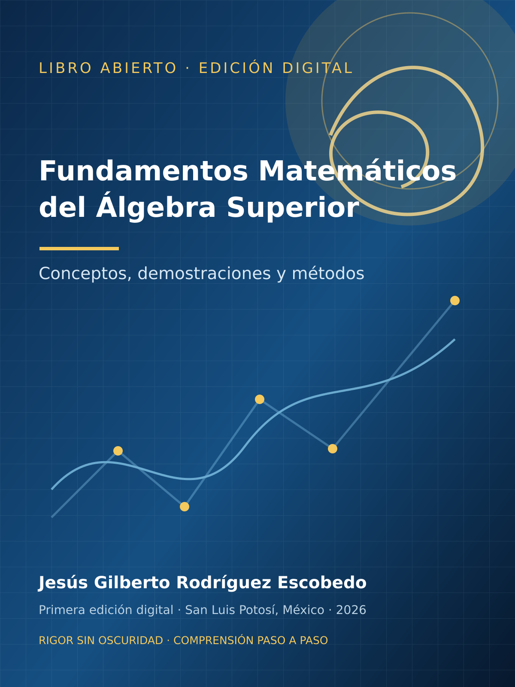

# Portada {.unnumbered .unlisted}

::: {.content-visible when-format="html"}
{fig-alt="Portada de Fundamentos Matemáticos del Álgebra Superior" width=100%}
:::

::: {.content-visible when-format="html"}

<a class="btn btn-primary" href="https://gilbertorodriguez59.github.io/libro-fundamentos-algebra-superior-dev/Fundamentos-Matematicos-Algebra-Superior-Capitulos-1-5.pdf">Descargar el libro completo en PDF</a>

:::

**Jesús Gilberto Rodríguez Escobedo**  
Primera edición digital, 2026 · San Luis Potosí, México  
Libro abierto bajo licencia CC BY-NC-SA 4.0.
